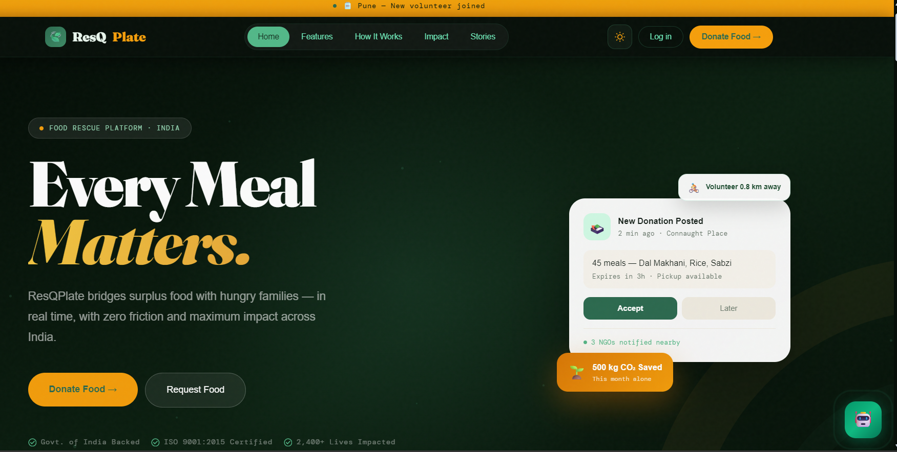
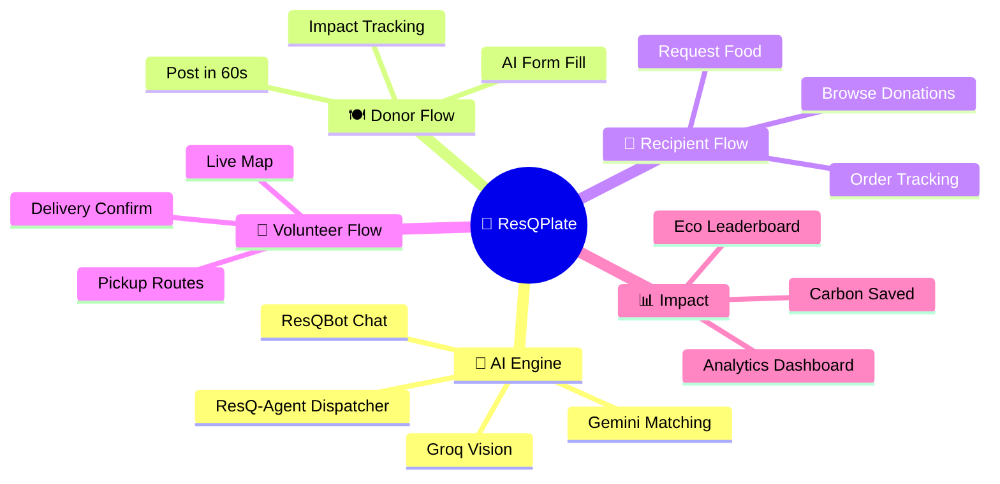
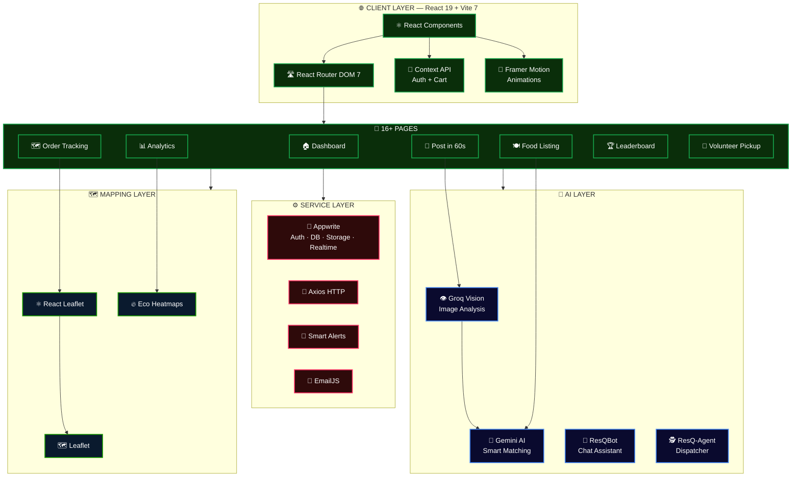
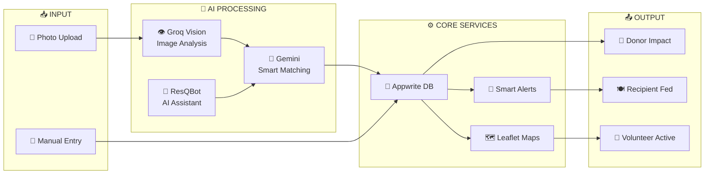
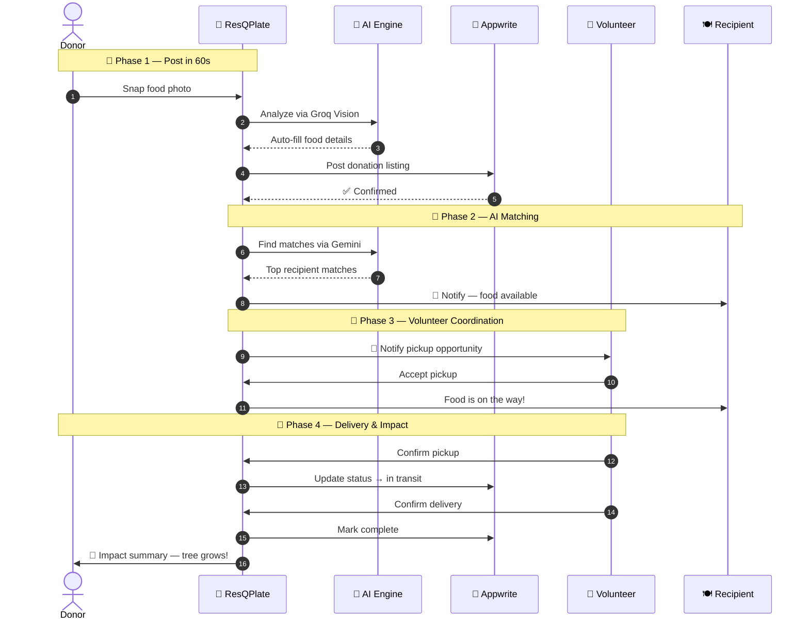

<div align="center">

<!-- ═══════════════════════════════════════════════════════════════ -->
<!--                       HERO BANNER                             -->
<!-- ═══════════════════════════════════════════════════════════════ -->


<br/>

<!-- ── Hero Image ── -->
<a href="https://github.com/salonyranjan/frontend-ResQplate-">
  
</a>

<br/><br/>


<br/><br/>

<!-- ── Tech Badges ── -->


<br/>


<br/>

<!-- ── Social Badges ── -->


<br/><br/>

> *"A community-driven food rescue platform where AI does the heavy lifting — snap a photo, and a meal reaches someone in need."*

<br/>

<a href="https://github.com/salonyranjan/frontend-ResQplate-"></a>
&nbsp;
<a href="#10--getting-started"></a>
&nbsp;
<a href="#4--key-features"></a>
&nbsp;
<a href="#13--contributing"></a>

</div>

---

## 📋 Table of Contents

1. [🌿 What is ResQPlate?](#1--what-is-resqplate)
2. [🖼️ UI Showcase](#2-%EF%B8%8F-ui-showcase)
3. [📊 Platform at a Glance](#3--platform-at-a-glance)
4. [✨ Key Features](#4--key-features)
5. [🏗️ System Architecture](#5-%EF%B8%8F-system-architecture)
   - 5.1 [🔷 Architecture Diagram](#51--architecture-diagram)
   - 5.2 [🧠 AI Layer Deep-Dive](#52--ai-layer-deep-dive)
   - 5.3 [🔄 Data Flow Diagram](#53--data-flow-diagram)
6. [🛤️ User Journey](#6-%EF%B8%8F-user-journey)
7. [🗺️ 3D System Map](#7-%EF%B8%8F-3d-system-map)
8. [🛠️ Tech Stack](#8-%EF%B8%8F-tech-stack)
9. [📂 Project Structure](#9--project-structure)
10. [📦 Getting Started](#10--getting-started)
    - 10.1 [🔧 Prerequisites](#101--prerequisites)
    - 10.2 [⬇️ Install](#102-%EF%B8%8F-install)
    - 10.3 [🔑 Environment Variables](#103--environment-variables)
    - 10.4 [🖥️ Run & Build](#104-%EF%B8%8F-run--build)
11. [⚡ Performance](#11--performance)
12. [🗺️ Roadmap](#12-%EF%B8%8F-roadmap)
13. [🤝 Contributing](#13--contributing)
14. [❓ FAQ](#14--faq)
15. [📄 Changelog](#15--changelog)
16. [👤 Author](#16--author)
17. [⭐ Show Your Support](#17--show-your-support)

---

## 1. 🌿 What is ResQPlate?

**ResQPlate** is a community-driven, AI-powered food rescue platform that connects **donors**, **recipients**, and **volunteers** to eliminate food waste and fight hunger. Donors can snap a photo of surplus food and post it in under **60 seconds** — Groq Vision automatically extracts food details, Gemini AI matches it to nearby recipients, and volunteers coordinate real-time pickups via interactive maps.

> 🎯 **Mission:** Bridge the gap between food surplus and food scarcity using AI, community, and data.

| 🔖 | Version | 📦 Highlight |
|:---:|:---:|:---|
| 🆕 | `v2.0` | ResQ-Agent Dispatcher · Eco-Heatmaps · Impact Analytics · Leaderboard |
| 🔄 | `v1.5` | Live order tracking · Volunteer routing · Smart Alerts · ResQBot |
| 🎉 | `v1.0` | Post in 60s · Groq Vision · Gemini Matching · Appwrite backend |

---

## 2. 🖼️ UI Showcase

<div align="center">


### 🏠 Dashboard — *Command Centre*


> ⚡ **Quick Action Cards** animate with botanical growth UI · **Impact stats** update in real-time · **Smart Alerts** pulse for nearby donations

<br/>

### 📸 Post in 60 Seconds — *AI-Powered Donation Flow*


> 🤖 **Groq Vision** reads the food photo instantly · **Gemini** auto-fills Title, Quantity, Expiry · Zero manual typing required

<br/>

### 🗺️ Live Order Tracking — *Real-Time Map*


> 📍 **Leaflet** maps volunteer position in real-time · **Route optimisation** for fastest pickup · Status updates ping donor and recipient simultaneously

<br/>

### 📊 Impact Analytics — *Community Leaderboard*


> 🌍 **Carbon saved** calculated per donation · **Meals rescued** counter · Eco-heatmaps show hunger vs. waste zones geospatially

</div>

<div align="center">

| 🖥️ View | 📱 Mobile | 💻 Tablet | 🖥️ Desktop |
|:---|:---:|:---:|:---:|
| 🏠 Dashboard | ✅ | ✅ | ✅ |
| 📸 Post in 60s | ✅ | ✅ | ✅ |
| 🗺️ Live Tracking | ✅ | ✅ | ✅ |
| 📊 Analytics | ✅ | ✅ | ✅ |
| 💬 ResQBot Chat | ✅ | ✅ | ✅ |

</div>

---

## 3. 📊 Platform at a Glance

<div align="center">



</div>

| 🔢 Metric | 🎯 Value | 📝 Notes |
|:---|:---:|:---|
| ⚡ **Post Time** | `< 60s` | Photo → live listing via Groq Vision |
| 🤖 **AI Models** | `2` | Groq Llama 3.2 Vision + Google Gemini |
| 📄 **App Pages** | `16+` | Full platform — dashboard to leaderboard |
| 🧩 **Components** | `25+` | Reusable atomic UI library |
| 🪝 **Custom Hooks** | `3` | Tracking, Alerts, Volunteer pickups |
| 🗺️ **Map Features** | `3` | Live tracking · Routing · Eco-Heatmaps |

---

## 4. ✨ Key Features

<table>
  <tr><td>📸</td><td><strong>Post in 60 Seconds</strong></td><td>Snap a food photo — Groq Vision + Gemini auto-extract title, quantity, expiry, and category. Zero typing.</td></tr>
  <tr><td>🤖</td><td><strong>Smart AI Matching</strong></td><td>Gemini AI matches donations with nearby recipients based on location, dietary need, and urgency</td></tr>
  <tr><td>💬</td><td><strong>ResQBot Chatbot</strong></td><td>Gemini-powered conversational assistant for platform navigation, donation tips, and impact queries</td></tr>
  <tr><td>🧠</td><td><strong>ResQ-Agent Dispatcher</strong></td><td>Deterministic agentic workflow (Groq Llama 3.1) for automated pickup negotiation between volunteers and donors</td></tr>
  <tr><td>🔥</td><td><strong>Smart Eco-Heatmaps</strong></td><td>Leaflet-powered geospatial visualisation showing hunger zones vs. food waste hotspots in your city</td></tr>
  <tr><td>🗺️</td><td><strong>Live Order Tracking</strong></td><td>Real-time volunteer position on an interactive map — donor and recipient both see pickup progress</td></tr>
  <tr><td>🚴</td><td><strong>Volunteer Pickups</strong></td><td>Route-optimised pickup scheduling with one-tap accept and delivery confirmation</td></tr>
  <tr><td>📊</td><td><strong>Impact Analytics</strong></td><td>Personal + global dashboards — meals rescued, carbon saved, waste diverted, all charted over time</td></tr>
  <tr><td>🏆</td><td><strong>Community Leaderboard</strong></td><td>Gamified ranking by donation impact — top donors and volunteers recognised in real-time</td></tr>
  <tr><td>🌱</td><td><strong>Botanical Growth UI</strong></td><td>Quick Action Cards animate as botanical trees growing — each donation visually grows the community garden</td></tr>
  <tr><td>🔔</td><td><strong>Smart Alerts</strong></td><td>Push notifications for nearby donation opportunities, expiring food, and pickup assignments</td></tr>
  <tr><td>🔐</td><td><strong>Secure Auth</strong></td><td>Appwrite-powered user authentication, profile management, and protected routes</td></tr>
</table>

---

## 5. 🏗️ System Architecture

### 5.1 🔷 Architecture Diagram



### 5.2 🧠 AI Layer Deep-Dive

| 🤖 Model | 🔧 Task | ⚡ Trigger | 🏆 Output |
|:---|:---|:---|:---|
| **Groq Llama 3.2 Vision** | Image analysis | Food photo uploaded | Title, quantity, expiry, category auto-filled |
| **Google Gemini** | Smart matching | Donation posted | Top-3 nearby recipient matches |
| **Google Gemini** | ResQBot chat | User question | Conversational platform guidance |
| **Groq Llama 3.1** | ResQ-Agent | Volunteer assigned | Pickup negotiation agentic workflow |

### 5.3 🔄 Data Flow Diagram



---

## 6. 🛤️ User Journey



---

## 7. 🗺️ 3D System Map

```
┌─────────────────────────────────────────────────────────────────────┐
│              🌐 FRONTEND LAYER  —  React 19 + Vite 7                │
│   ┌──────────────────────────────────────────────────────────────┐  │
│   │    Pages  •  Components  •  Hooks  •  Contexts  •  Layouts   │  │
│   └──────────────────────────────────────────────────────────────┘  │
└──────────────────────────────┬──────────────────────────────────────┘
                               │
┌──────────────────────────────▼──────────────────────────────────────┐
│               🤖 AI LAYER  —  Groq + Gemini                         │
│   ┌──────────────────────────────────────────────────────────────┐  │
│   │  Vision Analysis  •  Smart Matching  •  Chatbot  •  Agent   │  │
│   └──────────────────────────────────────────────────────────────┘  │
└──────────────────────────────┬──────────────────────────────────────┘
                               │
┌──────────────────────────────▼──────────────────────────────────────┐
│           🗺️ MAPPING LAYER  —  Leaflet + React Leaflet              │
│   ┌──────────────────────────────────────────────────────────────┐  │
│   │   Live Tracking  •  Route Optimisation  •  Eco-Heatmaps     │  │
│   └──────────────────────────────────────────────────────────────┘  │
└──────────────────────────────┬──────────────────────────────────────┘
                               │
┌──────────────────────────────▼──────────────────────────────────────┐
│              🔐 BACKEND LAYER  —  Appwrite Cloud                    │
│   ┌──────────────────────────────────────────────────────────────┐  │
│   │  Auth  •  Database  •  Storage  •  Functions  •  Realtime   │  │
│   └──────────────────────────────────────────────────────────────┘  │
└──────────────────────────────┬──────────────────────────────────────┘
                               │
                               ▼
                    🌍 Community Impact
             (🍽️ Food Waste ↓  ·  😊 Hunger ↓)
```

| 🏗️ Layer | ⚙️ Technologies | 📝 Responsibility |
|:---|:---|:---|
| 🌐 **Frontend** | React 19 · Vite 7 · Tailwind 4 · Framer Motion | UI rendering, animations, routing, state |
| 🤖 **AI Engine** | Groq SDK · Google Gemini | Image analysis, matching, chatbot, agent |
| 🗺️ **Maps** | Leaflet · React Leaflet | Live tracking, route optimisation, heatmaps |
| 🔐 **Backend** | Appwrite | Auth, database, file storage, realtime events |

---

## 8. 🛠️ Tech Stack

### ⚛️ Frontend
<p>
  
  
  
  
  
</p>

### 🤖 AI & Intelligence
<p>
  
  
  
</p>

### 🔐 Backend & Services
<p>
  
  
  
  
  
</p>

| ⚙️ Capability | 🔬 Implementation | 🏆 Result |
|:---|:---|:---|
| ⚡ Post Speed | Groq Vision → Gemini pipeline | Food listed in under 60 seconds |
| 🤖 AI Matching | Gemini location + need scoring | Right food to right person |
| 🗺️ Live Tracking | React Leaflet + Appwrite Realtime | Volunteer position updates live |
| 🎨 Animations | Framer Motion botanical variants | Engaging, purposeful micro-interactions |
| 🔐 Auth | Appwrite Auth + `ProtectedRoute` | Secure access control across all pages |
| 📊 Analytics | Client-side aggregation + charting | Personal + global impact dashboards |

---

## 9. 📂 Project Structure

```
🌿 ResQPlate/frontend/
│
├── 🎬 src/animations/
│   └── variants.js                  # Framer Motion animation variants
│
├── 🧩 src/components/
│   ├── 💬 Chat/
│   │   └── ResQBot.jsx              # Gemini AI chatbot interface
│   ├── 📧 Contact/
│   │   └── Contact.jsx              # Contact form (EmailJS)
│   ├── 📊 Dashboard/
│   │   ├── ImpactCard.jsx           # Animated impact statistics card
│   │   └── QuickDonationModal.jsx   # One-tap quick donation modal
│   ├── 📄 About.jsx                 # Platform about page
│   ├── 🃏 FoodCard.jsx              # Food listing item card
│   ├── 🏠 Landing.jsx               # Public landing page
│   ├── 🏷️ Logo.jsx                  # Brand logo component
│   ├── 🗺️ MapView.jsx               # Leaflet interactive map wrapper
│   ├── 🔝 Navbar.jsx                # Responsive navigation bar
│   ├── 🎞️ PageTransition.jsx        # Framer Motion page transitions
│   ├── 🔒 ProtectedRoute.jsx        # Auth guard for private routes
│   └── ⚡ QuickActionCard.jsx        # Botanical growth animated cards
│
├── 🔄 src/context/
│   ├── AuthContext.jsx              # Appwrite auth state + helpers
│   └── CartContext.jsx              # Food cart state management
│
├── 🪝 src/hooks/
│   ├── useOrderTracking.js          # Real-time order status logic
│   ├── useSmartAlerts.js            # Push notification + alert polling
│   └── useVolunteerPickups.js       # Volunteer assignment + routing
│
├── 🖼️ src/layouts/
│   └── DashboardLayout.jsx          # Shared dashboard sidebar + header
│
├── 📄 src/pages/
│   ├── 🤖 AIMatching.jsx            # Gemini-powered match discovery
│   ├── 📊 Analytics.jsx             # Impact charts + eco-heatmaps
│   ├── 🛒 Cart.jsx                  # Food cart review
│   ├── 💳 Checkout.jsx              # Checkout + confirmation flow
│   ├── 🏠 DashboardHome.jsx         # Main dashboard entry
│   ├── 📸 DonateFood.jsx            # Manual food donation form
│   ├── 🍽️ FoodListing.jsx           # Browse all available donations
│   ├── 🌿 ImpactDelivered.jsx       # Post-delivery impact summary
│   ├── 🏆 Leaderboard.jsx           # Community ranking board
│   ├── 🔑 Login.jsx                 # Appwrite auth login
│   ├── 🗺️ OrderTracking.jsx         # Live map order tracker
│   ├── ⚡ PostIn60Seconds.jsx        # AI-powered 60s donation flow
│   ├── 👤 Profile.jsx               # User profile + history
│   ├── ⚙️ Settings.jsx              # Preferences + notifications
│   ├── 📝 Signup.jsx                # New user registration
│   ├── 🔔 SmartAlerts.jsx           # Donation opportunity alerts
│   └── 🚴 VolunteerPickup.jsx       # Volunteer pickup dashboard
│
├── ⚙️ src/services/
│   ├── aiService.js                 # Groq + Gemini API wrappers
│   ├── appwrite.js                  # Appwrite client configuration
│   ├── dataService.js               # Data fetching + caching helpers
│   └── impactService.js             # Carbon + meal impact calculations
│
├── 🗄️ src/data/
│   └── mockData.js                  # Dev-time seed data
│
├── 🏠 src/App.jsx                   # Root component + all routes
├── 🚀 src/main.jsx                  # Vite app entry point
└── 🎨 src/index.css                 # Global styles + Tailwind directives
```

---

## 10. 📦 Getting Started

### 10.1 🔧 Prerequisites

| 🛠️ Tool | 📌 Version | 🔗 Link |
|:---|:---:|:---|
|  | `≥ 18.x` | [nodejs.org](https://nodejs.org/) |
|  | `≥ 8.x` | Bundled with Node |
| 🔐 **Appwrite** | Cloud or self-hosted | [appwrite.io](https://appwrite.io/) |
| 🤖 **Groq API Key** | Free tier | [console.groq.com](https://console.groq.com/) |
| 🧠 **Gemini API Key** | Free tier | [aistudio.google.com](https://aistudio.google.com/) |

### 10.2 ⬇️ Install

**📥 Step 1 — Clone**

```bash
git clone https://github.com/salonyranjan/frontend-ResQplate-.git
cd frontend-ResQplate-/frontend
```

**📦 Step 2 — Install dependencies**

```bash
npm install
```

### 10.3 🔑 Environment Variables

**🔐 Step 3 — Create `frontend/.env`**

```bash
cp .env.example .env
```

```env
# ── Appwrite (Backend) ──────────────────────────────────────────────
VITE_APPWRITE_ENDPOINT=https://cloud.appwrite.io/v1
VITE_APPWRITE_PROJECT_ID=your_project_id
VITE_APPWRITE_DATABASE_ID=your_database_id

# ── AI Services ─────────────────────────────────────────────────────
VITE_GROQ_API_KEY=your_groq_key
VITE_GEMINI_API_KEY=your_gemini_key

# ── EmailJS (Contact Form) ──────────────────────────────────────────
VITE_EMAILJS_PUBLIC_KEY=your_emailjs_public_key
VITE_EMAILJS_SERVICE_ID=your_service_id
VITE_EMAILJS_CONTACT_TEMPLATE_ID=your_template_id
```

> 🔐 **Security note:** `.env` is git-ignored. Never commit real keys. A `.env.example` template is provided — copy it and fill in your values.

### 10.4 🖥️ Run & Build

| 📜 Script | 💻 Command | 📝 Purpose |
|:---|:---|:---|
| 🚀 **Dev server** | `npm run dev` | Start Vite HMR at `http://localhost:5173` |
| 🏗️ **Production build** | `npm run build` | Optimised output in `dist/` |
| 🔍 **Preview build** | `npm run preview` | Test production build locally |
| 🧹 **Lint** | `npm run lint` | ESLint code quality check |

---

## 11. ⚡ Performance

| 📊 Metric | 🎯 Value | 📝 Notes |
|:---|:---:|:---|
| ⚡ **Post in 60s** | `< 60s` | Photo → live listing via Groq + Gemini |
| 🤖 **Groq Vision** | `~800ms` | Image analysis + field extraction |
| 🧠 **Gemini Match** | `~600ms` | Recipient matching query |
| 🏗️ **Vite Build** | `< 5s` | Production bundle with tree-shaking |
| 🗺️ **Map Render** | `< 200ms` | Leaflet tiles + marker placement |
| 🎨 **Animation FPS** | `60fps` | Framer Motion hardware-accelerated |
| 📦 **Bundle** | Minimised | Code splitting + lazy loading per route |

---

## 12. 🗺️ Roadmap

| Status | 🚀 Feature | 🎯 Priority |
|:---:|:---|:---:|
| ✅ | Post in 60s — Groq Vision + Gemini auto-fill | 🔴 Core |
| ✅ | Smart AI Matching — Gemini recipient discovery | 🔴 Core |
| ✅ | Live Order Tracking — Leaflet maps | 🔴 Core |
| ✅ | ResQBot — Gemini conversational assistant | 🔴 Core |
| ✅ | ResQ-Agent Dispatcher — Llama 3.1 agentic workflow | 🔴 Core |
| ✅ | Eco-Heatmaps — hunger vs. waste geospatial viz | 🔴 Core |
| ✅ | Leaderboard + Impact Analytics | 🔴 Core |
| 🔄 | **Push Notifications** — native browser alerts | 🟡 High |
| 🔄 | **Offline Mode** — PWA + service worker caching | 🟡 High |
| 🔄 | **Multi-language i18n** — regional language support | 🟡 High |
| 📅 | **Mobile App** — React Native port | 🟢 Planned |
| 📅 | **NGO Dashboard** — bulk donation management panel | 🟢 Planned |
| 📅 | **Carbon Credits** — blockchain-verified impact tokens | 🟢 Planned |
| 💡 | **AR Food Scanner** — camera overlay for food ID | 🔵 Idea |
| 💡 | **Voice Commands** — donate by speaking | 🔵 Idea |

> 💬 [Open a feature request →](https://github.com/salonyranjan/frontend-ResQplate-/issues/new)

---

## 13. 🤝 Contributing

All contributions to reduce food waste are **warmly welcome**! 🌿

```bash
# 1. Fork the repository on GitHub
# 2. Create your feature branch
git checkout -b feature/your-feature

# 3. Commit with conventional format
git commit -m "feat: add your feature"
# Prefixes: fix: | docs: | style: | refactor: | test: | chore:

# 4. Push & open a PR
git push origin feature/your-feature
```

**Contribution Guidelines:**
- Follow the existing ESLint config — run `npm run lint` before submitting
- Write meaningful, conventional commit messages
- Update relevant documentation if adding new features
- Test across mobile and desktop breakpoints

**Priority areas:**

| 🔥 Area | 📝 What's Needed |
|:---|:---|
| 🌐 i18n | Multi-language support with `react-i18next` |
| 📱 PWA | Service worker + offline caching strategy |
| 🧪 Tests | Vitest + React Testing Library component coverage |
| 🎨 UI | New Tailwind component variants, dark mode |

---

## 14. ❓ FAQ

<details>
<summary><strong>🤖 How does Post in 60 Seconds actually work?</strong></summary>

When you upload a food photo, it's sent to **Groq's Llama 3.2 Vision API**, which identifies the food type, quantity, and condition. That structured output is passed to **Google Gemini**, which writes a formatted listing title, selects the correct category, and estimates an expiry window. The entire round-trip takes under 2 seconds — you just review and tap Post.
</details>

<details>
<summary><strong>🔐 Are my API keys safe in the browser?</strong></summary>

This is a frontend-first project using `VITE_` prefixed env vars, which means keys are bundled into the client. For production at scale, proxy all AI calls through a backend serverless function (Appwrite Functions or Vercel Edge Functions) so keys never ship to the browser. A backend proxy layer is on the roadmap.
</details>

<details>
<summary><strong>🗺️ Does live tracking use real GPS?</strong></summary>

Yes — the `useOrderTracking` hook uses the browser's `navigator.geolocation` API to get the volunteer's coordinates and updates them in Appwrite Realtime. The donor and recipient see the volunteer's position update live on the Leaflet map without polling.
</details>

<details>
<summary><strong>🔌 Can I self-host Appwrite instead of using the cloud?</strong></summary>

Absolutely. Update `VITE_APPWRITE_ENDPOINT` in `.env` to your self-hosted instance URL (e.g. `https://appwrite.yourdomain.com/v1`). All Appwrite SDK calls in `src/services/appwrite.js` will automatically point to your instance.
</details>

---

## 15. 📄 Changelog

| Version | Highlights |
|:---|:---|
| 🆕 `v2.0.0` | ResQ-Agent Dispatcher · Eco-Heatmaps · Analytics · Leaderboard · Botanical UI |
| `v1.5.0` | Live order tracking · Volunteer routing · Smart Alerts · ResQBot chatbot |
| `v1.0.0` | 🎉 Initial release — Post in 60s · Groq Vision · Gemini Matching · Appwrite |

---

## 16. 👤 Author

<table style="border:none;">
  <tr>
    <td align="center" style="border:none;" width="160">
      
    </td>
    <td style="border:none; padding-left:22px;">
      <h3>✦ Salony Ranjan</h3>
      <p>🤖 AI Engineer &nbsp;·&nbsp; 🧑‍💻 Full-Stack Dev &nbsp;·&nbsp; 🌿 Tech for Social Good</p>
      <p><em>"Using AI and community to turn food surplus into impact — one plate at a time."</em></p>
      <br/>
      <a href="https://www.linkedin.com/in/salony-ranjan-b63200280/"></a>
      &nbsp;
      <a href="https://github.com/salonyranjan"></a>
      &nbsp;
      <a href="mailto:salonyranjan@gmail.com"></a>
      &nbsp;
      <a href="https://vertex-flow-phi.vercel.app/"></a>
    </td>
  </tr>
</table>

---

## 17. ⭐ Show Your Support

<div align="center">

If ResQPlate inspired you, taught you something new, or made you think about food waste differently — show it some love! 🌿

> 💡 **Pro Tip:** Go to GitHub repo **Settings → Social Preview** and upload the hero screenshot. When you share on LinkedIn, your beautiful Cyber-Green UI shows instead of a generic GitHub card — perfect for a social impact project.

<a href="https://github.com/salonyranjan/frontend-ResQplate-/stargazers"></a>
&nbsp;
<a href="https://github.com/salonyranjan/frontend-ResQplate-/fork"></a>
&nbsp;
<a href="https://github.com/salonyranjan/frontend-ResQplate-"></a>
&nbsp;
<a href="https://github.com/salonyranjan/frontend-ResQplate-/issues/new"></a>

<br/><br/>


<br/>

*Made with* 🌿 *by* [**Salony Ranjan**](https://github.com/salonyranjan) &nbsp;·&nbsp; *© 2026 ResQPlate · MIT*


</div>
