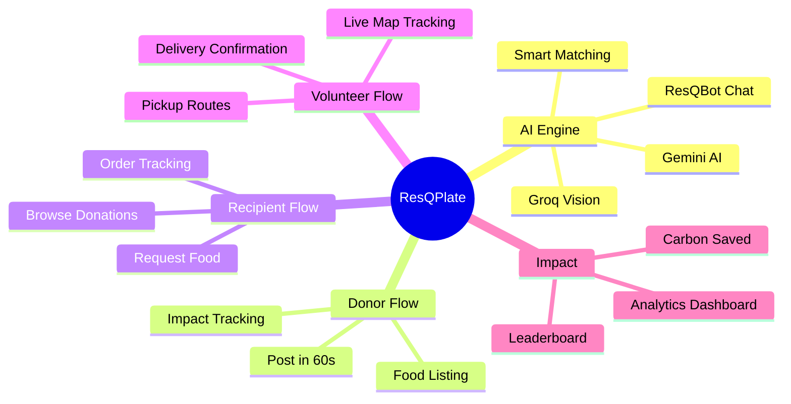
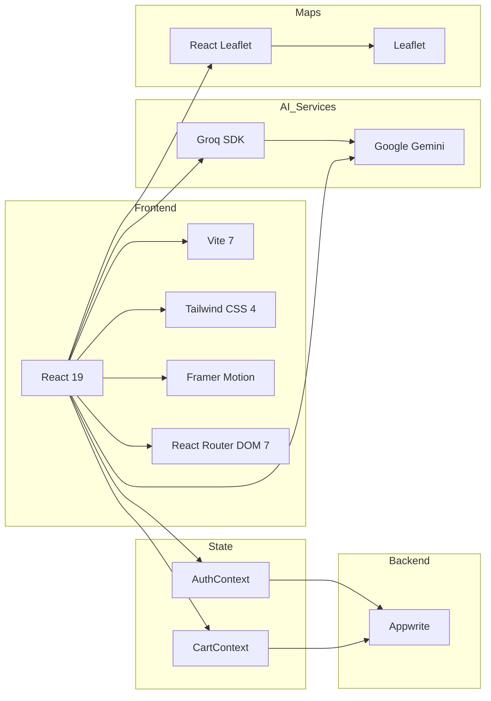
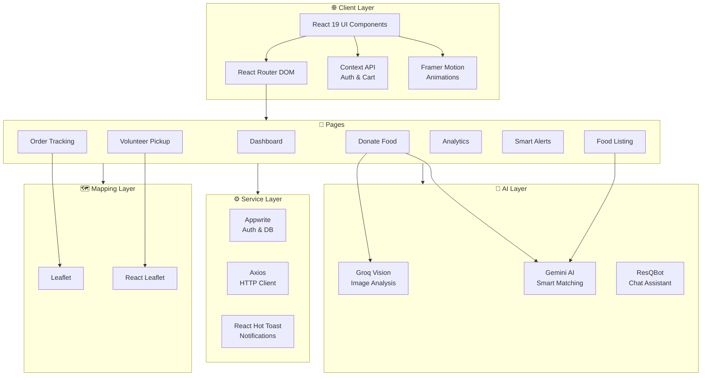
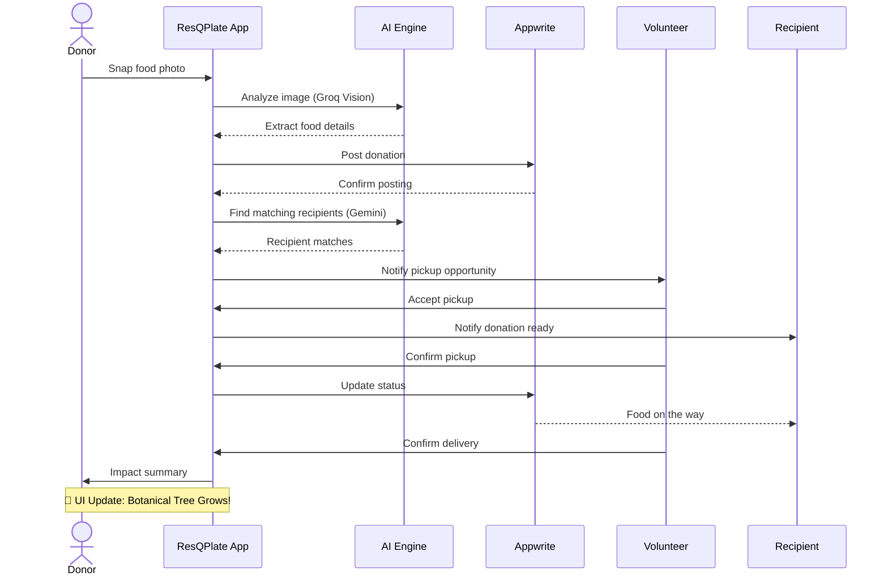
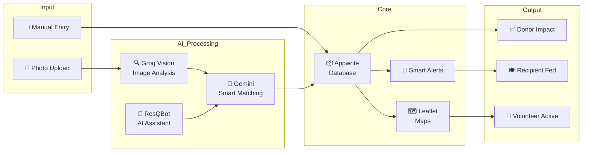
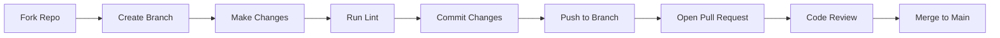

# 🌿ResQPlate 
<p align="center">
  
</p>

<h1 align="center">ResQPlate</h1>

<p align="center">
  🍽️ A modern, AI-powered food rescue platform connecting donors, recipients, and volunteers to reduce food waste and fight hunger.
</p>

<p align="center">
  
  
  
  
  
  
  
</p>

## Table of Contents

- [Overview](#overview)
- [Key Features](#key-features)
- [Tech Stack](#tech-stack)
- [Architecture](#architecture)
- [User Journey](#user-journey)
- [3D System Architecture](#3d-system-architecture)
- [Project Structure](#project-structure)
- [Getting Started](#getting-started)
- [Environment Variables](#environment-variables)
- [Available Scripts](#available-scripts)
- [Contributing](#contributing)
- [License](#license)
- [Contact](#contact)

---

## Overview

ResQPlate is a community-driven food rescue platform that leverages AI to streamline food donation. Donors can snap a photo of surplus food and post it in under 60 seconds using Groq Vision and Gemini AI. The platform automatically matches donations with nearby recipients, coordinates volunteer pickups via interactive maps, and tracks the entire journey in real-time.



---

## Key Features

| Feature | Description | AI Powered |
|---------|-------------|------------|
| **Post in 60 Seconds** | Snap a photo, AI extracts food details automatically | ✅ Groq Vision + Gemini |
| **Smart AI Matching** | Matches donations with nearby recipients based on need | ✅ Gemini |
| **ResQBot Chatbot** | Conversational AI assistant for platform navigation | ✅ Gemini |
| **ResQ-Agent Dispatcher** | Deterministic agentic workflow for pickup negotiation | ✅ Groq (Llama 3.1) |
| **Smart Eco-Heatmaps** | Geospatial data visualization of hunger vs. waste zones | 🗺️ Leaflet Heatmaps |
| **Live Order Tracking** | Real-time map-based pickup and delivery tracking | 🗺️ Leaflet |
| **Volunteer Pickups** | Route optimization and pickup scheduling | 🗺️ Leaflet |
| **Impact Analytics** | Personal and global impact dashboards with charts | 📊 |
| **Quick Action Cards** | Animated botanical growth UI for rapid actions | 🎨 Framer Motion |
| **Smart Alerts** | Real-time notifications for donation opportunities | 🔔 |
| **Leaderboard** | Community ranking based on donation impact | 🏆 |
| **Secure Auth** | User authentication and profile management | 🔐 Appwrite |

---

## Tech Stack



---

## Architecture



---

## User Journey



---

## 3D System Architecture

```
          ┌───────────────────────────────────────────────────────────────────┐
          │                  🌐 FRONTEND LAYER (React 19 + Vite)              |
          │    ┌─────────────────────────────────────────────────────────┐    │
          │    │      Pages  •  Components  •  Hooks  •  Contexts        │    │
          │    └─────────────────────────────────────────────────────────┘    │
          └─────────────────────────────────┬─────────────────────────────────┘
                                            │
          ┌─────────────────────────────────▼─────────────────────────────────┐
          │                   🤖 AI LAYER (Groq + Gemini)                     │
          │    ┌─────────────────────────────────────────────────────────┐    │
          │    │      Vision  •  Matching  •  Chatbot  •  Alerts         │    │
          │    └─────────────────────────────────────────────────────────┘    │
          └─────────────────────────────────┬─────────────────────────────────┘
                                            │
          ┌─────────────────────────────────▼─────────────────────────────────┐
          │             🗺️ MAPS LAYER (Leaflet + React Leaflet)               │
          │    ┌─────────────────────────────────────────────────────────┐    │
          │    │    Tracking  •  Routing  •  Volunteers  •  Live Updates │    │
          │    └─────────────────────────────────────────────────────────┘    │
          └─────────────────────────────────┬─────────────────────────────────┘
                                            │
          ┌─────────────────────────────────▼─────────────────────────────────┐
          │                   🔐 BACKEND LAYER (Appwrite)                     │
          │    ┌─────────────────────────────────────────────────────────┐    │
          │    │    Auth  •  Database  •  Storage  •  Functions  •  Realtime  │ 
          │    └─────────────────────────────────────────────────────────┘    │
          └─────────────────────────────────┬─────────────────────────────────┘
                                            │
                                            ▼
                                   🌍 Community Impact
                                (Food Waste ↓, Hunger ↓)
```

### 3D Layer Breakdown

| Layer | Technologies | Responsibility |
|-------|-------------|----------------|
| **Frontend** | React 19, Vite 7, Tailwind CSS 4, Framer Motion | UI rendering, animations, routing |
| **AI Engine** | Groq SDK, Google Gemini | Image analysis, smart matching, chatbot |
| **Maps** | Leaflet, React Leaflet | Live tracking, route optimization |
| **Backend** | Appwrite | Auth, database, storage, realtime |

---

## Project Structure

```
src/
├── animations/          # Framer Motion animation variants
│   └── variants.js
├── components/          # Reusable UI components
│   ├── Chat/
│   │   └── ResQBot.jsx             # AI chatbot component
│   ├── Contact/
│   │   └── Contact.jsx             # Contact page
│   ├── Dashboard/
│   │   ├── ImpactCard.jsx          # Impact statistics card
│   │   └── QuickDonationModal.jsx  # Quick donation modal
│   ├── About.jsx                   # About page
│   ├── FoodCard.jsx                # Food item card
│   ├── Landing.jsx                 # Landing page
│   ├── Logo.jsx                    # Logo component
│   ├── MapView.jsx                 # Interactive map view
│   ├── Navbar.jsx                  # Navigation bar
│   ├── PageTransition.jsx          # Page transition animations
│   ├── ProtectedRoute.jsx          # Route guard
│   └── QuickActionCard.jsx         # Animated action cards
├── context/             # React Context providers
│   ├── AuthContext.jsx             # Authentication state
│   └── CartContext.jsx             # Shopping cart state
├── hooks/               # Custom React hooks
│   ├── useOrderTracking.js         # Order tracking logic
│   ├── useSmartAlerts.js           # Smart alert notifications
│   └── useVolunteerPickups.js      # Volunteer pickup logic
├── layouts/             # Layout components
│   └── DashboardLayout.jsx         # Dashboard layout wrapper
├── pages/               # Application pages
│   ├── AIMatching.jsx              # AI matching page
│   ├── Analytics.jsx               # Impact analytics
│   ├── Cart.jsx                    # Shopping cart
│   ├── Checkout.jsx                # Checkout flow
│   ├── DashboardHome.jsx           # Dashboard landing
│   ├── DonateFood.jsx              # Food donation form
│   ├── FoodListing.jsx             # Browse donations
│   ├── ImpactDelivered.jsx        # Impact summary
│   ├── Leaderboard.jsx             # Community leaderboard
│   ├── Login.jsx                   # Login page
│   ├── OrderTracking.jsx           # Live order tracking
│   ├── PostIn60Seconds.jsx         # AI-powered quick post
│   ├── Profile.jsx                 # User profile
│   ├── Settings.jsx                # User settings
│   ├── Signup.jsx                  # Registration page
│   ├── SmartAlerts.jsx             # Smart alerts page
│   └── VolunteerPickup.jsx         # Volunteer pickup page
├── services/            # API and third-party integrations
│   ├── aiService.js                # AI service (Groq + Gemini)
│   ├── appwrite.js                 # Appwrite client setup
│   ├── dataService.js              # Data fetching services
│   └── impactService.js            # Impact calculation
├── data/
│   └── mockData.js                 # Mock data for development
├── App.jsx                         # Root component with routing
├── main.jsx                        # Application entry point
└── index.css                       # Global styles + Tailwind
```

---

## Getting Started

### Prerequisites

- **Node.js** >= 18.x
- **npm** or **yarn**
- **Appwrite** instance (self-hosted or [cloud](https://appwrite.io/))
- **Groq API Key** — [Get one here](https://console.groq.com/)
- **Google Gemini API Key** — [Get one here](https://aistudio.google.com/)

### Installation

```bash
# Clone the repository
git clone https://github.com/yourusername/ResQPlate_frontend.git
cd ResQPlate_frontend/frontend

# Install dependencies
npm install

# Set up environment variables (see below)

# Start the development server
npm run dev
```

The app will be running at `http://localhost:5173`

---

## Environment Variables

Create a `.env` file in the `frontend/` root directory:

```env
# Appwrite (Backend)
VITE_APPWRITE_ENDPOINT=https://cloud.appwrite.io/v1
VITE_APPWRITE_PROJECT_ID=your_id
VITE_APPWRITE_DATABASE_ID=your_db_id

# AI Services (Groq + Gemini)
VITE_GROQ_API_KEY=your_key
VITE_GEMINI_API_KEY=your_key

# Communications (EmailJS)
VITE_EMAILJS_PUBLIC_KEY=your_key
VITE_EMAILJS_SERVICE_ID=your_service_id
VITE_EMAILJS_CONTACT_TEMPLATE_ID=your_template_id
```

> **Note:** Never commit your `.env` file. A `.env.example` is provided as a template.

---

## Available Scripts

| Script | Description |
|--------|-------------|
| `npm run dev` | Start the development server with HMR |
| `npm run build` | Build the app for production |
| `npm run lint` | Run ESLint to check code quality |
| `npm run preview` | Preview the production build locally |

---

## Data Flow Diagram



---

## Contributing

We welcome contributions! Here's how to get started:



1. **Fork** the repository
2. **Create** your feature branch (`git checkout -b feature/amazing-feature`)
3. **Commit** your changes (`git commit -m 'Add amazing feature'`)
4. **Push** to the branch (`git push origin feature/amazing-feature`)
5. **Open** a Pull Request

### Contribution Guidelines

- Follow the existing code style (ESLint config provided)
- Write meaningful commit messages
- Update documentation as needed
- Test your changes thoroughly

---

## License

Distributed under the **MIT License**. See `LICENSE` for more information.

---

## Contact

**Project Maintainer:** Salony Ranjan

**Project Link:**( https://github.com/salonyranjan/frontend-ResQplate-)

---

<div align="center">

🍽️ **Join the fight against food waste with ResQPlate!** 🍽️

*Every donation counts. Every meal matters.*

</div>
