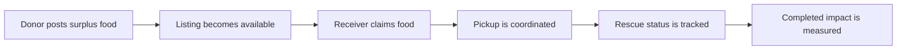
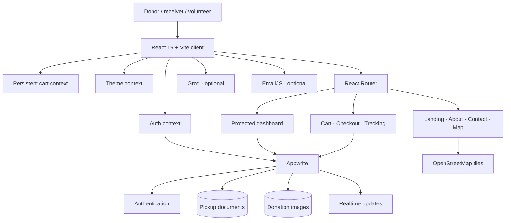

<div align="center">


# ResQPlate

### Rescue surplus food. Coordinate pickups. Measure real impact.

A responsive food-rescue platform connecting surplus-food donors with people and organizations that can put it to use.

[](https://react.dev/)
[](https://vite.dev/)
[](https://appwrite.io/)
[](https://leafletjs.com/)
[](https://groq.com/)

[Explore Features](#-feature-highlights) · [Architecture](#-architecture) · [Run Locally](#-run-locally) · [Configure Appwrite](#-appwrite-setup) · [Deploy](#-deployment)

> **Demo project:** ResQPlate demonstrates a complete food-rescue workflow. Donation records, availability, tracking states, and analytics are read from Appwrite rather than fabricated in the interface.

</div>

---

## 🌱 Why ResQPlate?

Perfectly usable food is often discarded because donors and receivers lack a fast coordination channel. ResQPlate turns that gap into a simple operational flow:


```mermaid
flowchart LR
  A["Donor posts surplus food"] --> B["Listing becomes available"]
  B --> C["Receiver claims food"]
  C --> D["Pickup is coordinated"]
  D --> E["Rescue status is tracked"]
  E --> F["Completed impact is measured"]
```

The application combines a polished public experience with an authenticated workspace for posting food, browsing live donations, claiming items, following pickups, and reviewing impact.

---

## 🎨 Visual direction

<div align="center">
  
  <br />
  <sub>A human-centered visual system built around dignity, clarity, and community action.</sub>
</div>

### Experience map

| Public experience | Rescue workspace | Fulfilment |
| --- | --- | --- |
| Focused landing page | Operational overview | Persistent rescue cart |
| About and contact pages | Post surplus food | Free checkout and claim flow |
| Interactive rescue-plate game | Browse live listings | Pickup status tracking |
| Responsive food-rescue map | Analytics and activity alerts | Light and dark themes |
| ResQBot support assistant | Profile and preferences | Mobile-first navigation |

> Add product screenshots under `frontend/public/screenshots/` for a portfolio or hackathon submission. Keeping screenshots in the repository ensures this README never depends on temporary links.

---

## ✨ Feature highlights

| Area | Capability |
| --- | --- |
| 🔐 Authentication | Registration, login, session restoration, logout, and protected routes through Appwrite Auth |
| 🍱 Donations | Post food type, meal quantity, description, pickup location, expiry, and a validated food image |
| 🔎 Discovery | Search, filter, and sort pending donations while automatically hiding expired listings |
| 🛒 Rescue flow | Add available donations to a persistent cart and claim them through a free checkout flow |
| 📍 Tracking | Follow a rescue from `pending` through confirmation, preparation, transit, and completion |
| 📊 Dashboard | Live overview, donor history, record-based analytics, activity alerts, and operational pages |
| 🗺️ Map | Leaflet and OpenStreetMap-powered public map experience |
| 🤖 Assistance | ResQBot food-rescue guidance and optional Groq-powered responses |
| ✉️ Contact | Optional EmailJS-powered contact delivery |
| 🌓 Design system | Shared typography, responsive layouts, accessible controls, and persistent light/dark mode |
| ⚡ Performance | Route-level code splitting so dashboard, map, AI, and tracking screens load on demand |

---

## 🏗 Architecture


```mermaid
flowchart TD
  U["Donor / receiver / volunteer"] --> UI["React 19 + Vite client"]
  UI --> AUTH["Auth context"]
  UI --> CART["Persistent cart context"]
  UI --> THEME["Theme context"]
  UI --> ROUTER["React Router"]
  ROUTER --> PUBLIC["Landing · About · Contact · Map"]
  ROUTER --> DASH["Protected dashboard"]
  ROUTER --> FLOW["Cart · Checkout · Tracking"]
  AUTH --> AW["Appwrite"]
  DASH --> AW
  FLOW --> AW
  AW --> ACCOUNT["Authentication"]
  AW --> DB[("Pickup documents")]
  AW --> STORAGE[("Donation images")]
  AW --> REALTIME["Realtime updates"]
  UI --> GROQ["Groq · optional"]
  UI --> EMAIL["EmailJS · optional"]
  PUBLIC --> OSM["OpenStreetMap tiles"]
```

### Data lifecycle

```text
pending → confirmed → preparing → out_for_delivery → completed
   └──────────────── cancelled can end an active rescue ────────────────┘
```

- New donations are stored as `pending`.
- Browse Food displays only pending, unexpired records.
- Claiming a donation changes it to `confirmed`, removing it from availability.
- Historical records remain in Appwrite so tracking and analytics stay accurate.

---

## 🧰 Tech stack

| Layer | Technology |
| --- | --- |
| Application | React 19, React Router 7, Vite 7 |
| Styling | Tailwind CSS 4, responsive component CSS, shared design tokens |
| Motion | Framer Motion |
| Backend platform | Appwrite Auth, Databases, Storage, and Realtime |
| Mapping | Leaflet, React Leaflet, OpenStreetMap |
| AI | Groq SDK (optional) |
| Contact delivery | EmailJS (optional) |
| Icons | React Icons, Lucide React |
| Deployment | Static SPA hosting; Vercel rewrite configuration included |

---

## 🗂 Project map

```text
ResQPlate_frontend/
├── .github/workflows/          Appwrite availability and reminder workflows
├── frontend/
│   ├── public/                 Logo, sitemap, and public assets
│   ├── src/
│   │   ├── components/         Marketing UI, navigation, map, cards, and ResQBot
│   │   ├── context/            Authentication, cart, and theme state
│   │   ├── hooks/              Tracking, alerts, and pickup data hooks
│   │   ├── layouts/            Responsive dashboard shell
│   │   ├── pages/              Route-level application screens
│   │   ├── services/           Appwrite, food data, and optional AI integrations
│   │   ├── App.jsx             Route configuration and lazy-loaded screens
│   │   └── main.jsx            Application providers and browser entry point
│   ├── .env.example            Safe environment-variable template
│   ├── vercel.json             SPA rewrites and caching headers
│   └── package.json            Commands and dependencies
└── README.md
```

---

## ⚙️ Requirements

- Node.js **20.19+** or **22.12+**
- npm
- An [Appwrite](https://appwrite.io/) project
- Optional Groq and EmailJS accounts for AI and contact features

---

## 🚀 Run locally

```bash
# 1. Clone the repository
git clone https://github.com/salonyranjan/ResQpla8.git
cd ResQpla8/frontend

# 2. Install locked dependencies
npm ci

# 3. Create your local environment file
cp .env.example .env

# 4. Start the development server
npm run dev
```

On Windows PowerShell:

```powershell
Copy-Item .env.example .env
```

Open the URL printed by Vite—normally **http://localhost:5173**.

---

## 🔐 Environment variables

| Variable | Required | Purpose |
| --- | :---: | --- |
| `VITE_APPWRITE_ENDPOINT` | ✅ | Appwrite API endpoint, such as `https://fra.cloud.appwrite.io/v1` |
| `VITE_APPWRITE_PROJECT_ID` | ✅ | Appwrite project identifier |
| `VITE_APPWRITE_DATABASE_ID` | ✅ | Database containing rescue pickup records |
| `VITE_APPWRITE_PICKUPS_COLLECTION_ID` | ✅ | Pickup collection identifier |
| `VITE_APPWRITE_BUCKET_ID` | Optional | Storage bucket for donation photographs |
| `VITE_GROQ_API_KEY` | Optional | Enables Groq-backed assistant and AI utilities |
| `VITE_EMAILJS_SERVICE_ID` | Optional | EmailJS service identifier |
| `VITE_EMAILJS_TEMPLATE_ID` | Optional | Landing form template identifier |
| `VITE_EMAILJS_CONTACT_TEMPLATE_ID` | Optional | Contact form template identifier |
| `VITE_EMAILJS_PUBLIC_KEY` | Optional | EmailJS browser public key |

```dotenv
VITE_APPWRITE_ENDPOINT=https://fra.cloud.appwrite.io/v1
VITE_APPWRITE_PROJECT_ID=your_project_id
VITE_APPWRITE_DATABASE_ID=your_database_id
VITE_APPWRITE_PICKUPS_COLLECTION_ID=pickups
VITE_APPWRITE_BUCKET_ID=

VITE_GROQ_API_KEY=
VITE_EMAILJS_SERVICE_ID=
VITE_EMAILJS_TEMPLATE_ID=
VITE_EMAILJS_CONTACT_TEMPLATE_ID=
VITE_EMAILJS_PUBLIC_KEY=
```

> **Security:** every `VITE_` value is bundled into browser code. Never place an Appwrite server API key or another privileged secret here. For production AI, proxy Groq calls through an Appwrite Function or another server endpoint.

---

## 🗄 Appwrite setup

### 1. Register the frontend

Add `localhost` and every deployed hostname under **Appwrite Console → Project → Platforms → Web**. Authentication rejects unregistered origins.

### 2. Enable authentication

Enable Appwrite's Email/Password authentication method.

### 3. Create the pickup collection

| Attribute | Suggested type | Required |
| --- | --- | :---: |
| `pickupId` | String | ✅ |
| `pickupLocation` | String | ✅ |
| `dropOffLocation` | String |  |
| `scheduledTime` | Datetime | ✅ |
| `status` | String or enum | ✅ |
| `vehicleType` | String | ✅ |
| `donorId` | String | ✅ |
| `weight` | Float | ✅ |
| `mealsCount` | Integer | ✅ |
| `foodType` | String (250+ characters) | ✅ |
| `location` | String | ✅ |

Create indexes for `status`, descending `$createdAt`, and their combination if requested by Appwrite.

### 4. Configure permissions

- Authenticated donors need document-create permission.
- Intended users need read permission for available donations.
- Claim and status workflows require carefully scoped update permission.
- Do **not** grant public update or delete permission.
- Enable document security and role-specific permissions before production.

### 5. Optional image storage

Create a Storage bucket when `VITE_APPWRITE_BUCKET_ID` is configured. Authenticated users need create permission and intended viewers need read permission. Donation file IDs match pickup document IDs.

---

## 🧭 Routes

### Public routes

| Route | Experience |
| --- | --- |
| `/` | Landing page and quick rescue game |
| `/about` | Project story |
| `/contact` | Contact experience |
| `/map` | Food-rescue map |
| `/login` | Sign in |
| `/register` | Create an account |

### Protected routes

| Route | Experience |
| --- | --- |
| `/dashboard` | Operational overview |
| `/dashboard/donate` | Post surplus food |
| `/dashboard/search` | Browse available food |
| `/dashboard/analytics` | Live record-based analytics |
| `/dashboard/smart-alerts` | Rescue activity alerts |
| `/dashboard/ai-matching` | Donation matching preview |
| `/dashboard/volunteer` | Volunteer pickup operations |
| `/dashboard/impact-delivered` | Completed impact view |
| `/dashboard/leader-board` | Rescue leaderboard |
| `/dashboard/profile` | Profile and donation history |
| `/dashboard/settings` | Account preferences |
| `/cart` | Selected donations |
| `/checkout` | Claim flow |
| `/tracking/:orderId` | Individual rescue tracking |

Unknown routes safely redirect to `/`.

---

## ✅ Quality checks

```bash
cd frontend
npm run lint
npm run build
npm run preview
```

| Command | Result |
| --- | --- |
| `npm run dev` | Starts the Vite development server |
| `npm run lint` | Checks the frontend with ESLint |
| `npm run build` | Generates the optimized production bundle in `dist/` |
| `npm run preview` | Serves the production bundle locally |

---

## 🌐 Deployment

ResQPlate is a client-side SPA and can be deployed to Vercel, Netlify, Cloudflare Pages, or another static host.

| Setting | Value |
| --- | --- |
| Root directory | `frontend` |
| Install command | `npm ci` |
| Build command | `npm run build` |
| Output directory | `dist` |

Deployment checklist:

1. Add required environment variables in the hosting dashboard.
2. Configure an SPA fallback so application paths serve `index.html`.
3. Add the production hostname as an Appwrite Web platform.
4. Verify signup, login, donation creation, image access, claiming, and realtime updates.
5. Never commit `frontend/.env`.

The included `frontend/vercel.json` already provides Vercel SPA rewrites and immutable asset caching.

---

## 🛠 Troubleshooting

| Problem | Check |
| --- | --- |
| Appwrite configuration error | Confirm endpoint and project ID, then restart Vite |
| Login reports unknown origin | Register the exact hostname as an Appwrite Web platform |
| Dashboard cannot load data | Verify IDs, attributes, permissions, and indexes |
| Images do not appear | Verify bucket ID plus file create/read permissions |
| Claimed food disappears from Browse Food | Expected: its status changed from `pending` to `confirmed` |
| Refreshing a deployed route returns 404 | Add the SPA rewrite to `index.html` |
| ResQBot is unavailable | Add a valid Groq key or move the integration to a server function |
| Contact messages fail | Verify EmailJS identifiers and the selected template |

---

## 🤝 Contributing

1. Fork the repository.
2. Create a focused branch: `git checkout -b feature/your-feature`.
3. Make and verify your changes.
4. Run `npm run lint` and `npm run build`.
5. Open a pull request explaining the user-facing impact.

---

## 👩‍💻 Maintainer

Developed and maintained by [Salony Ranjan](https://github.com/salonyranjan).

Issues and contributions are welcome in the [ResQPlate repository](https://github.com/salonyranjan/ResQpla8).

<div align="center">

**Built to make every surplus meal easier to rescue.**

</div>
