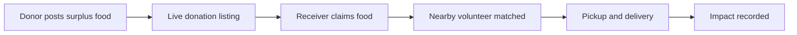
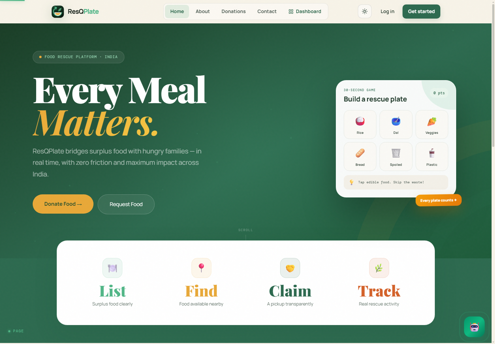
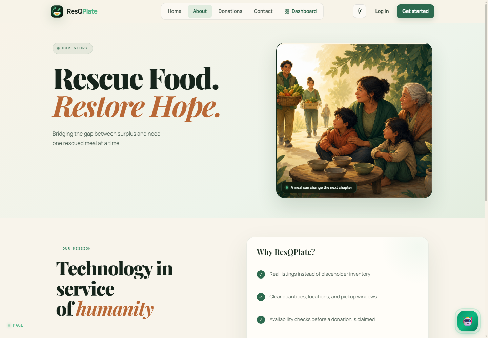
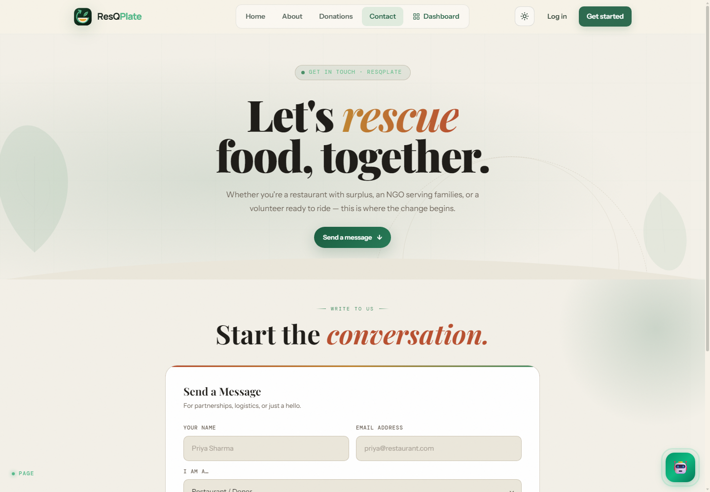
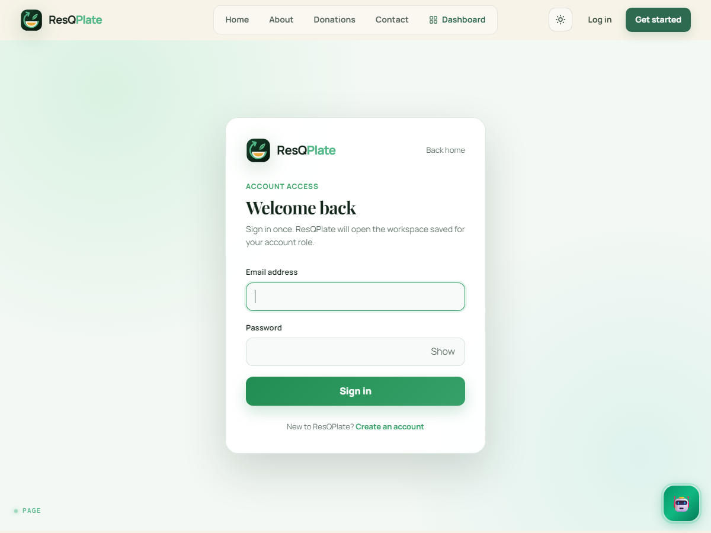
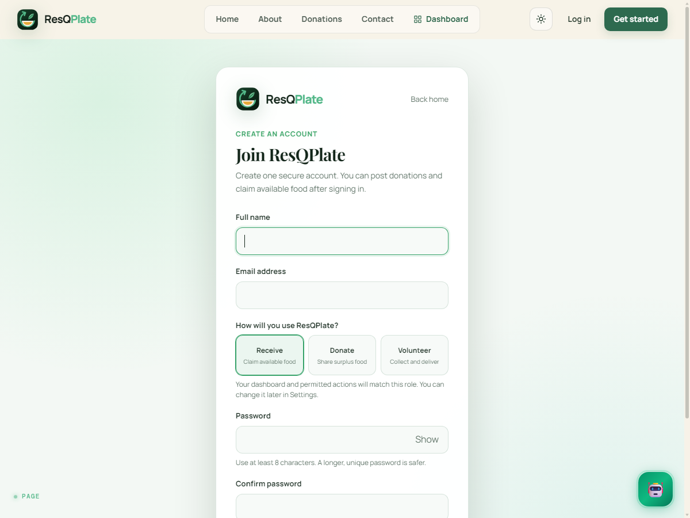
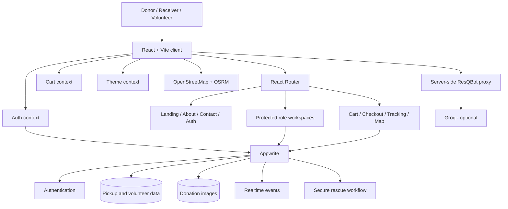

<div align="center">


# ResQPlate

### Rescue surplus food. Coordinate delivery. Measure real impact.

ResQPlate is a responsive food-rescue platform connecting donors, receivers, and volunteers through secure role-based workflows, live rescue data, maps, tracking, and impact reporting.

[](https://react.dev/)
[](https://vite.dev/)
[](https://appwrite.io/)
[](https://leafletjs.com/)

[**Open live application**](https://res-q-plate.vercel.app/) · [Features](#feature-highlights) · [Workflow](#how-resqplate-works) · [Setup](#local-development) · [Deployment](#deployment)

> ResQPlate is a pilot-stage application. Review [PRODUCTION_READINESS.md](./PRODUCTION_READINESS.md) before an unrestricted public launch.

</div>

---

## Why ResQPlate?

Usable food is frequently discarded because donors and receivers lack a fast, transparent coordination channel. ResQPlate turns surplus food into a trackable rescue workflow:


```mermaid
flowchart LR
  D[Donor posts surplus food] --> L[Live donation listing]
  L --> R[Receiver claims food]
  R --> V[Nearby volunteer matched]
  V --> P[Pickup and delivery]
  P --> I[Impact recorded]
```

The platform combines a polished public experience with authenticated workspaces designed around the responsibilities of each participant.

---

## Application preview

All screenshots show the current application in light mode.

<div align="center">
  <a href="https://res-q-plate.vercel.app/">
    
  </a>
  <br />
  <sub>Focused rescue messaging, direct role actions, and an interactive rescue-plate game.</sub>
</div>

<br />

<table>
  <tr>
    <td width="50%" align="center">
      <strong>About ResQPlate</strong><br /><br />
      
    </td>
    <td width="50%" align="center">
      <strong>Contact experience</strong><br /><br />
      
    </td>
  </tr>
  <tr>
    <td width="50%" align="center">
      <strong>Secure sign in</strong><br /><br />
      
    </td>
    <td width="50%" align="center">
      <strong>Role-based signup</strong><br /><br />
      
    </td>
  </tr>
</table>

---

## Feature highlights

| Area | Capabilities |
| --- | --- |
| Authentication | Appwrite email/password accounts, session restoration, protected routes, role-aware destinations, profiles, preferences, and logout |
| Donations | Post food type, quantity, description, photograph, pickup address, coordinates, and rescue deadline |
| Discovery | Browse, search, filter, and sort active donations while excluding claimed, cancelled, delivered, and expired records |
| Rescue cart | Persist selected donations locally, validate quantities, review selections, and complete a free checkout flow |
| Secure claims | Reserve donations through the authenticated Appwrite rescue function and record receiver ownership |
| Volunteer routing | Rank available volunteers using distance, capacity, reliability, and urgency; privately accept or decline assignments |
| Maps | Display verified pickup locations, road routes, distance, and estimated journey duration using Leaflet and OSRM |
| Tracking | Follow rescue status through posting, reservation, delivery, completion, or cancellation with Realtime updates |
| Dashboard | Role-specific navigation, live metrics, donation history, analytics, activity alerts, impact views, and leaderboard |
| Assistance | ResQBot with built-in food-rescue guidance and optional server-side Groq responses |
| Experience | Responsive layouts, accessible controls, route-level code splitting, reduced-motion support, and persistent light/dark themes |

---

## How ResQPlate works

### Donor workflow

1. Create an account and select the **Donor** role.
2. Open **Post food** and provide the food details, meal count, image, pickup address, and expiry window.
3. ResQPlate validates the form, geocodes the address, uploads the image, and creates the Appwrite record.
4. Monitor reservations, active rescues, completed deliveries, analytics, and impact from the dashboard.
5. Cancel an active donation through the secure server workflow when necessary.

### Receiver workflow

1. Create an account with the **Receiver** role.
2. Browse available, unexpired donations or use the matching experience.
3. Add suitable donations to the rescue cart.
4. Confirm a complete delivery address at checkout.
5. The server workflow verifies availability, reserves the donations, records receiver ownership, and removes them from public availability.
6. Follow the rescue from reservation through delivery using Order Tracking.

### Volunteer workflow

1. Select the **Volunteer** role and configure availability, location, and meal capacity.
2. The secure Appwrite Function finds eligible rescues and ranks volunteers using distance, capacity, reliability, and urgency.
3. Accept or decline private assignments.
4. Open donor directions and the verified donor-to-receiver route.
5. Confirm delivery only after a receiver has claimed the food.

### Rescue state model

```text
posted (pending, no receiver)
        ↓
reserved (pending, receiver assigned)
        ↓
delivered (completed)

cancelled closes an active rescue without marking it delivered
```

Availability is derived from persisted Appwrite data. A donation is available only when it is pending, unclaimed, valid, and unexpired.

---

## Architecture


```mermaid
flowchart TD
  U[Donor / Receiver / Volunteer] --> UI[React + Vite client]
  UI --> ROUTER[React Router]
  UI --> AUTH[Auth context]
  UI --> CART[Cart context]
  UI --> THEME[Theme context]

  ROUTER --> PUBLIC[Landing / About / Contact / Auth]
  ROUTER --> DASH[Protected role workspaces]
  ROUTER --> FLOW[Cart / Checkout / Tracking / Map]

  AUTH --> AW[Appwrite]
  DASH --> AW
  FLOW --> AW

  AW --> ACCOUNT[Authentication]
  AW --> DB[(Pickup and volunteer data)]
  AW --> STORAGE[(Donation images)]
  AW --> REALTIME[Realtime events]
  AW --> FUNCTION[Secure rescue workflow]

  UI --> MAPS[OpenStreetMap + OSRM]
  UI --> BOT[Server-side ResQBot proxy]
  BOT --> GROQ[Groq - optional]
```

### Security boundary

- Browser code reads only `VITE_` configuration values, which are public by design.
- Sensitive AI credentials remain server-side.
- Pickup claims, donor cancellations, volunteer responses, and delivery completion use the authenticated Appwrite Function.
- Pickup records allow authenticated creation and reading but do not grant public/client update access.
- Receiver identity is stored with a claimed rescue.
- Volunteer notifications use private document permissions.

---

## Technology stack

| Layer | Technology |
| --- | --- |
| Frontend | React 19, React Router 7, Vite 7 |
| Styling | Tailwind CSS 4, responsive component styles, shared design tokens |
| Motion | Framer Motion |
| Backend | Appwrite Auth, Databases, Storage, Realtime, Functions |
| Mapping | Leaflet, React Leaflet, OpenStreetMap, OSRM |
| AI | Server-side Groq proxy with a built-in fallback assistant |
| Contact | EmailJS integration (optional) |
| Deployment | Vercel-ready static SPA |

---

## Project structure

```text
ResQPlate_frontend/
├── .github/workflows/          Appwrite health and console reminders
├── appwrite.config.json        Versioned backend schema and function config
├── functions/
│   └── rescue-workflow/        Secure claims, cancellation, matching, and delivery
├── frontend/
│   ├── api/                     Server-side ResQBot proxy
│   ├── public/                  Logo, sitemap, screenshots, verification assets
│   ├── src/
│   │   ├── components/          Marketing UI, navigation, map, cards, ResQBot
│   │   ├── context/             Authentication, cart, and theme state
│   │   ├── hooks/               Tracking, alerts, and volunteer data
│   │   ├── layouts/             Responsive dashboard shell
│   │   ├── pages/               Route-level application screens
│   │   └── services/            Appwrite, workflow, geocoding, and routing logic
│   ├── tests/                   Role and workflow regression tests
│   ├── .env.example             Safe configuration template
│   ├── vercel.json              SPA rewrites and cache headers
│   └── package.json             Commands and dependencies
├── PRODUCTION_READINESS.md
└── README.md
```

---

## Local development

### Requirements

- Node.js **20.19+** or **22.12+**
- npm
- An Appwrite project
- Optional Groq and EmailJS accounts

### Installation

```bash
git clone https://github.com/salonyranjan/ResQpla8.git
cd ResQpla8/frontend
npm ci
cp .env.example .env
npm run dev
```

Windows PowerShell:

```powershell
Copy-Item .env.example .env
```

Open the address printed by Vite, normally `http://localhost:5173`.

---

## Environment configuration

Start with [`frontend/.env.example`](./frontend/.env.example).

| Variable | Required | Purpose |
| --- | :---: | --- |
| `VITE_APPWRITE_ENDPOINT` | Yes | Appwrite API endpoint |
| `VITE_APPWRITE_PROJECT_ID` | Yes | Appwrite project identifier |
| `VITE_APPWRITE_DATABASE_ID` | Yes | Rescue database identifier |
| `VITE_APPWRITE_PICKUPS_COLLECTION_ID` | Yes | Pickup collection/table identifier |
| `VITE_APPWRITE_BUCKET_ID` | For posting | Donation image bucket |
| `VITE_APPWRITE_VOLUNTEERS_COLLECTION_ID` | For volunteers | Volunteer profile collection |
| `VITE_APPWRITE_NOTIFICATIONS_COLLECTION_ID` | For volunteers | Private assignment collection |
| `VITE_APPWRITE_VOLUNTEER_FUNCTION_ID` | For secure operations | Rescue workflow Function ID |
| `VITE_GEOCODER_ENDPOINT` | Optional | Forward-geocoding service override |
| `VITE_ROUTING_ENDPOINT` | Optional | Road-routing service override |
| `VITE_ASSISTANT_API_URL` | Optional | ResQBot proxy override |
| `GROQ_API_KEY` | Optional, server only | Groq credential used by the server proxy |
| `GROQ_MODEL` | Optional, server only | Groq model identifier |
| `VITE_EMAILJS_*` | Optional | EmailJS service, templates, and public key |

Minimal example:

```dotenv
VITE_APPWRITE_ENDPOINT=https://fra.cloud.appwrite.io/v1
VITE_APPWRITE_PROJECT_ID=
VITE_APPWRITE_DATABASE_ID=
VITE_APPWRITE_PICKUPS_COLLECTION_ID=pickups
VITE_APPWRITE_BUCKET_ID=
VITE_APPWRITE_VOLUNTEER_FUNCTION_ID=
```

> Never commit `frontend/.env`. Every `VITE_` value is bundled into browser code, so secrets must not use that prefix.

---

## Appwrite setup

The repository includes the versioned configuration in [`appwrite.config.json`](./appwrite.config.json).

1. Log in with the Appwrite CLI.
2. Link or initialize the intended Appwrite project.
3. Push the table configuration.
4. Deploy and activate `functions/rescue-workflow`.
5. Configure the Function variables and document read/write scopes.
6. Add localhost and every deployed hostname under **Appwrite Console → Project → Platforms → Web**.
7. Copy the project, database, collection, bucket, and Function IDs into the frontend environment.

The rescue Function requires these server variables:

```text
RESQPLATE_DATABASE_ID
RESQPLATE_PICKUPS_COLLECTION_ID
RESQPLATE_VOLUNTEERS_COLLECTION_ID
RESQPLATE_NOTIFICATIONS_COLLECTION_ID
```

Do not restore anonymous pickup creation or public update permissions. Server-side workflows are the authorization boundary for rescue state changes.

---

## Routes

### Public and authentication

| Route | Experience |
| --- | --- |
| `/` | Landing page and rescue-plate game |
| `/about` | Mission, story, values, and impact |
| `/contact` | Contact form and participation options |
| `/login` | Account sign in |
| `/register` | Role-based account creation |
| `/map` | Public rescue map shell |

### Protected and role-aware

| Route | Access | Experience |
| --- | --- | --- |
| `/dashboard` | All roles | Operational overview |
| `/dashboard/donate` | Donor | Post surplus food |
| `/dashboard/search` | Receiver | Browse available donations |
| `/donations` | Receiver | Receiver donation discovery |
| `/cart` | Receiver | Selected donations |
| `/checkout` | Receiver | Secure claim flow |
| `/dashboard/volunteer` | Volunteer | Pickup assignments and availability |
| `/dashboard/orders` | All roles | Rescue history and tracking |
| `/tracking/:orderId` | Signed in | Individual rescue tracking |
| `/dashboard/map` | Signed in | Verified rescue routes |
| `/dashboard/analytics` | Donor | Donation analytics |
| `/dashboard/smart-alerts` | Signed in | Activity alerts |
| `/dashboard/profile` | Signed in | Account profile and history |
| `/dashboard/settings` | Signed in | Preferences, account, and role setup |

Unknown routes safely redirect to the landing page.

---

## Quality checks

```bash
cd frontend
npm test
npm run lint
npm run build
npm run preview
```

| Command | Purpose |
| --- | --- |
| `npm test` | Runs role-access and pickup-workflow regression tests |
| `npm run lint` | Checks React and JavaScript quality with ESLint |
| `npm run build` | Produces the optimized production bundle |
| `npm run preview` | Serves the production build locally |

Before release, manually verify complete donor, receiver, and volunteer journeys using dedicated test accounts.

---

## Deployment

ResQPlate can be deployed to Vercel or another static SPA host.

| Setting | Value |
| --- | --- |
| Root directory | `frontend` |
| Install command | `npm ci` |
| Build command | `npm run build` |
| Output directory | `dist` |

Deployment checklist:

1. Add the frontend environment variables to the hosting provider.
2. Keep `GROQ_API_KEY` server-side.
3. Deploy and activate the Appwrite rescue Function.
4. Register the production hostname as an Appwrite Web platform.
5. Confirm SPA fallback behavior for deep links.
6. Test signup, login, posting, image upload, claiming, routing, delivery, and logout.
7. Configure `APPWRITE_ENDPOINT` and `APPWRITE_PROJECT_ID` for the GitHub health workflow.

The included [`frontend/vercel.json`](./frontend/vercel.json) provides SPA rewrites and immutable caching for built assets.

---

## Troubleshooting

| Problem | Recommended check |
| --- | --- |
| Appwrite configuration error | Verify the endpoint and project ID, then restart Vite |
| Login reports an unknown origin | Register the exact hostname as an Appwrite Web platform |
| Dashboard data cannot load | Confirm IDs, schema, permissions, and the active project |
| Donation image upload fails | Verify bucket ID, file type, size, and authenticated create permission |
| Claim or cancellation fails | Confirm the rescue Function is deployed and its ID is configured |
| Volunteer assignments remain empty | Verify volunteer/notification collections, Function variables, and document scopes |
| Map has no route | Confirm valid coordinates, receiver address, and routing-provider availability |
| ResQBot uses built-in guidance only | Configure `GROQ_API_KEY` on the server and redeploy |
| Contact delivery fails | Verify EmailJS service, template IDs, public key, and template fields |
| A deployed deep link returns 404 | Configure an SPA fallback to `index.html` |

---

## Contributing

1. Fork the repository.
2. Create a focused branch.
3. Make a small, documented change.
4. Run tests, lint, and the production build.
5. Open a pull request describing the user-facing impact.

## Maintainer

Developed and maintained by [Salony Ranjan](https://github.com/salonyranjan).

Issues and contributions are welcome in the [ResQPlate repository](https://github.com/salonyranjan/ResQpla8).

<div align="center">

**Built to make every surplus meal easier to rescue.**

</div>
