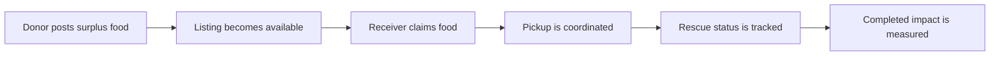
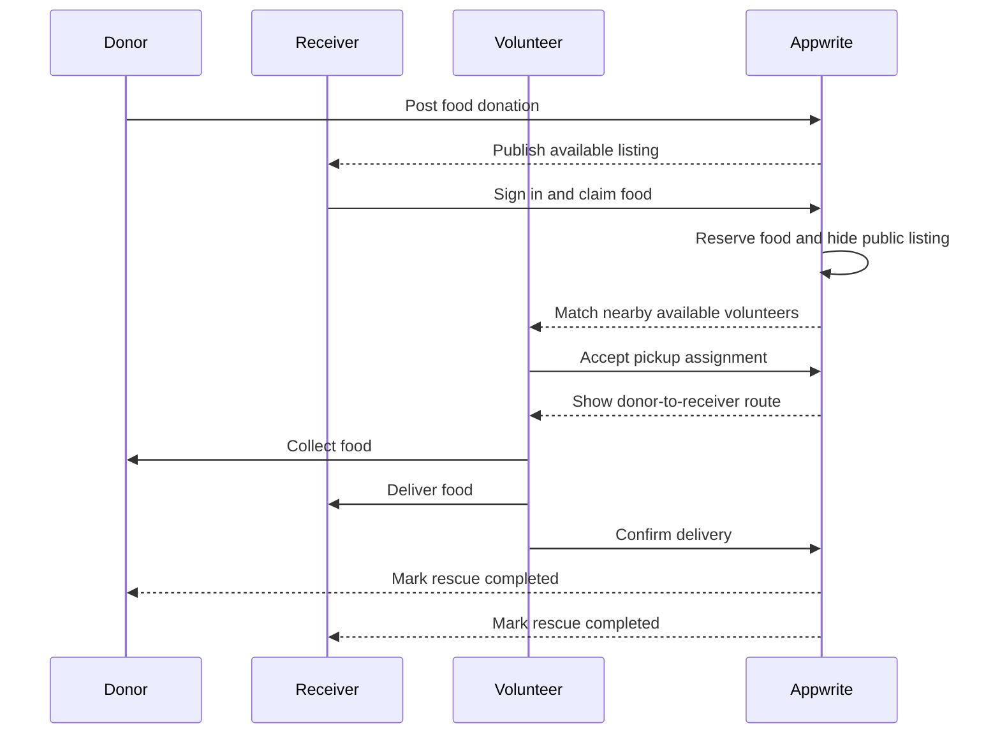
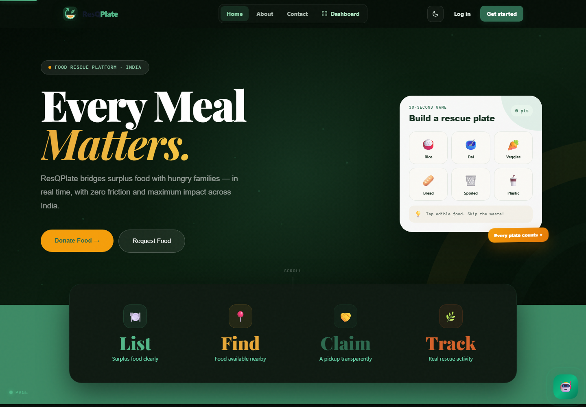
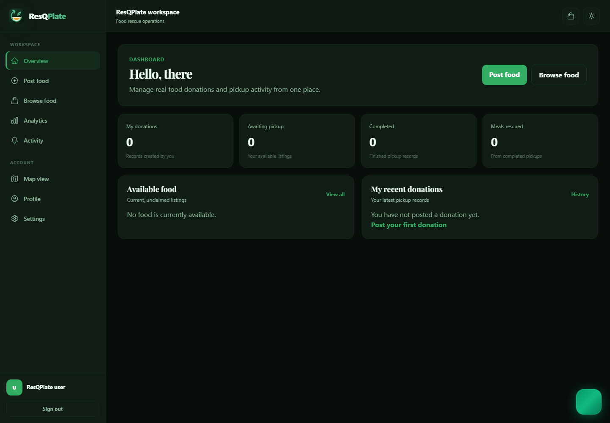
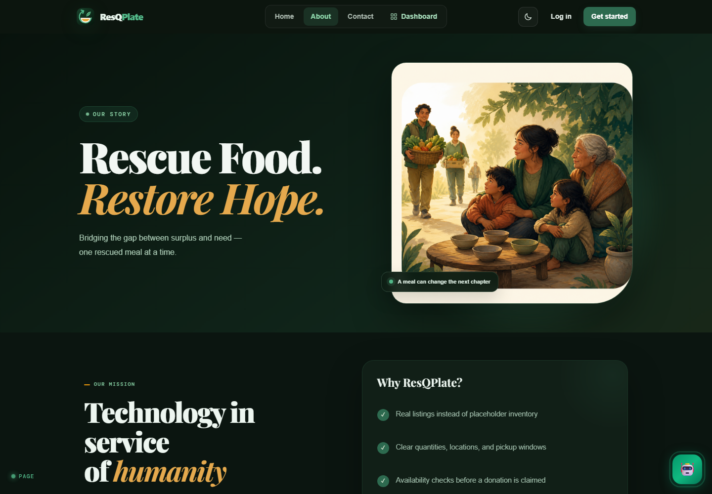
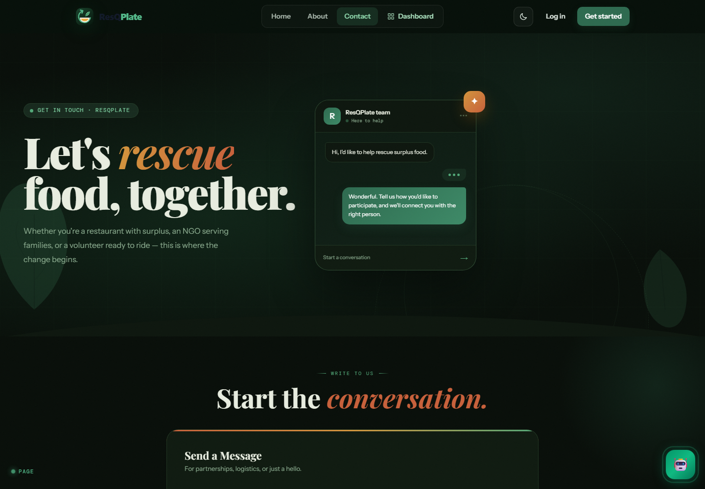
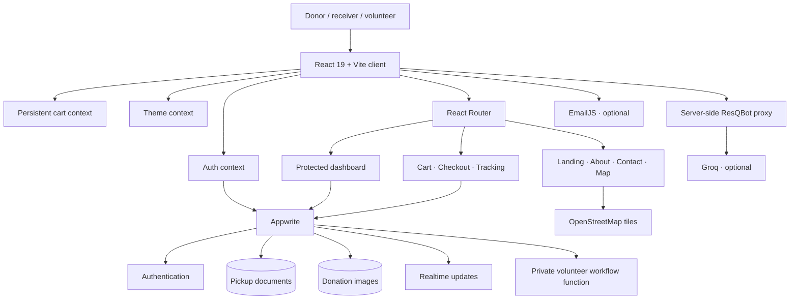

<div align="center">


# ResQPlate

### Rescue surplus food. Coordinate pickups. Measure real impact.

A responsive food-rescue platform connecting surplus-food donors with people and organizations that can put it to use.

[](https://react.dev/)
[](https://vite.dev/)
[](https://appwrite.io/)
[](https://leafletjs.com/)
[](https://groq.com/)

[](https://res-q-plate.vercel.app/)

[Explore Features](#-feature-highlights) · [Architecture](#-architecture) · [Run Locally](#-run-locally) · [Configure Appwrite](#-appwrite-setup) · [Deploy](#-deployment)

> **Pilot-stage project:** ResQPlate reads operational data from Appwrite and implements the core rescue workflow. Review [PRODUCTION_READINESS.md](./PRODUCTION_READINESS.md) before using it as a public service.

</div>

---

## 🌱 Why ResQPlate?

Perfectly usable food is often discarded because donors and receivers lack a fast coordination channel. ResQPlate turns that gap into a simple operational flow:


```mermaid
flowchart LR
  A["Donor posts surplus food"] --> B["Listing becomes available"]
  B --> C["Receiver claims food"]
  C --> D["Pickup is coordinated"]
  D --> E["Rescue status is tracked"]
  E --> F["Completed impact is measured"]
```

The application combines a polished public experience with an authenticated workspace for posting food, browsing live donations, claiming items, following pickups, and reviewing impact.

---

## How the application works

ResQPlate coordinates three participants:

- **Donors** publish safe surplus food with its quantity, photograph, pickup address, and rescue deadline.
- **Receivers** publicly browse donations and sign in only when they are ready to claim food.
- **Volunteers** publish availability, location, and carrying capacity so nearby assignments can be matched to them.

### End-to-end rescue workflow


```mermaid
sequenceDiagram
  participant D as Donor
  participant R as Receiver
  participant V as Volunteer
  participant A as Appwrite
  D->>A: Post food donation
  A-->>R: Publish available listing
  R->>A: Sign in and claim food
  A->>A: Reserve food and hide public listing
  A-->>V: Match nearby available volunteers
  V->>A: Accept pickup assignment
  A-->>V: Show donor-to-receiver route
  V->>D: Collect food
  V->>R: Deliver food
  V->>A: Confirm delivery
  A-->>D: Mark rescue completed
  A-->>R: Mark rescue completed
```

### Donation and discovery

1. A signed-in donor opens **Post Food** and enters the food details, meal count, photograph, pickup address, and expiry window.
2. ResQPlate geocodes the address and stores the donation and image in Appwrite.
3. The donation appears on `/donations`. Visitors can search and filter without creating an account.
4. Expired, reserved, cancelled, or delivered donations are excluded from availability.

### Claiming and reservation

1. Selecting **Claim Food** requires authentication.
2. The receiver confirms the food and supplies a delivery address.
3. The donation is reserved and disappears from public availability immediately.
4. Reservation does not mark food delivered. Completion happens after the volunteer confirms delivery.

### Volunteer pickup

1. A volunteer enables volunteering, shares their current location with consent, sets a meal capacity, and controls availability.
2. Matching ranks volunteers using distance, capacity, reliability, and urgency.
3. A matched volunteer can accept or decline the private assignment.
4. An accepted volunteer can open donor directions and the complete donor-to-receiver route.
5. Delivery confirmation is enabled only after a receiver address exists.

### Map and order tracking

- Dashboard Map View shows only verified claimed pickups with donor coordinates and a receiver address.
- It renders the donor marker, receiver marker, shortest available driving route, distance, and estimated duration.
- It does not draw a misleading straight line when a verified road route is unavailable.
- Order Tracking shows account rescue activity as awaiting receiver, reserved, delivered, or cancelled.
- Appwrite Realtime updates tracking data, with periodic refresh as a fallback.

### Authentication and data

- Appwrite Auth manages registration, login, session restoration, profiles, preferences, and logout.
- Signup requires a donor, receiver, or volunteer role. Login restores it, opens the correct workspace, and route guards prevent other role workspaces from being opened. Appwrite permissions and the rescue function remain the server-side authorization boundary.
- Appwrite Databases stores donations, volunteer profiles, and private assignment notifications.
- Appwrite Storage stores donation photographs.
- Leaflet and OpenStreetMap render maps; configured geocoding and routing services resolve locations and road routes.

> **Production note:** this implementation is intended for a controlled pilot. Atomic server-side transitions, strict document permissions, structured food-safety data, verified handoffs, scheduled expiry, moderation, and incident response are required before unrestricted public use. See [PRODUCTION_READINESS.md](./PRODUCTION_READINESS.md).

---

## 📸 App preview

<div align="center">
  <a href="https://res-q-plate.vercel.app/">
    
  </a>
  <br />
  <sub>Landing experience — focused messaging, direct actions, and an interactive rescue-plate game.</sub>
</div>

<br />

<div align="center">
  <strong>Rescue workspace dashboard</strong><br /><br />
  
  <br />
  <sub>A focused workspace for posting surplus food, monitoring pickups, and tracking rescue activity.</sub>
</div>

<br />

<table>
  <tr>
    <td align="center" width="50%">
      <strong>About ResQPlate</strong><br /><br />
      
    </td>
    <td align="center" width="50%">
      <strong>Contact experience</strong><br /><br />
      
    </td>
  </tr>
</table>

<div align="center">

### [Launch the live application →](https://res-q-plate.vercel.app/)

</div>

### Experience overview

| Public experience | Rescue workspace | Fulfilment |
| --- | --- | --- |
| Focused landing page | Operational overview | Persistent rescue cart |
| About and contact pages | Post surplus food | Free checkout and claim flow |
| Interactive rescue-plate game | Browse live listings | Pickup status tracking |
| Responsive food-rescue map | Analytics and activity alerts | Light and dark themes |
| ResQBot support assistant | Profile and preferences | Mobile-first navigation |

> Add product screenshots under `frontend/public/screenshots/` for a portfolio or hackathon submission. Keeping screenshots in the repository ensures this README never depends on temporary links.

---

## ✨ Feature highlights

| Area | Capability |
| --- | --- |
| 🔐 Authentication | Role-based signup, role-aware login destinations, session restoration, logout, and protected routes through Appwrite Auth |
| 🍱 Donations | Post food type, meal quantity, description, pickup location, expiry, and a validated food image |
| 🔎 Discovery | Search, filter, and sort pending donations while automatically hiding expired listings |
| 🛒 Rescue flow | Add available donations to a persistent cart and claim them through a free checkout flow |
| 📍 Tracking | Follow a rescue from `pending` through confirmation, preparation, transit, and completion |
| 📊 Dashboard | Live overview, donor history, record-based analytics, activity alerts, and operational pages |
| 🗺️ Map | Leaflet and OpenStreetMap-powered public map experience |
| 🤖 Assistance | ResQBot food-rescue guidance and optional Groq-powered responses |
| ✉️ Contact | Optional EmailJS-powered contact delivery |
| 🌓 Design system | Shared typography, responsive layouts, accessible controls, and persistent light/dark mode |
| ⚡ Performance | Route-level code splitting so dashboard, map, AI, and tracking screens load on demand |

---

## 🏗 Architecture


```mermaid
flowchart TD
  U["Donor / receiver / volunteer"] --> UI["React 19 + Vite client"]
  UI --> AUTH["Auth context"]
  UI --> CART["Persistent cart context"]
  UI --> THEME["Theme context"]
  UI --> ROUTER["React Router"]
  ROUTER --> PUBLIC["Landing · About · Contact · Map"]
  ROUTER --> DASH["Protected dashboard"]
  ROUTER --> FLOW["Cart · Checkout · Tracking"]
  AUTH --> AW["Appwrite"]
  DASH --> AW
  FLOW --> AW
  AW --> ACCOUNT["Authentication"]
  AW --> DB[("Pickup documents")]
  AW --> STORAGE[("Donation images")]
  AW --> REALTIME["Realtime updates"]
  AW --> WORKFLOW["Private volunteer workflow function"]
  UI --> PROXY["Server-side ResQBot proxy"]
  PROXY --> GROQ["Groq · optional"]
  UI --> EMAIL["EmailJS · optional"]
  PUBLIC --> OSM["OpenStreetMap tiles"]
```

### Data lifecycle

```text
posted (pending, no receiver) → reserved (pending, receiver assigned) → delivered (completed)
                                  └─ volunteer accepts and fulfils the pickup
cancelled can close an active rescue
```

- New donations are stored as `pending`.
- Browse Food displays only pending, unexpired records.
- Claiming assigns the receiver address and reserves the donation, removing it from availability without falsely marking it delivered.
- The assigned volunteer marks the pickup `completed` only after delivery.
- Historical records remain in Appwrite so tracking and analytics stay accurate.

---

## 🧰 Tech stack

| Layer | Technology |
| --- | --- |
| Application | React 19, React Router 7, Vite 7 |
| Styling | Tailwind CSS 4, responsive component CSS, shared design tokens |
| Motion | Framer Motion |
| Backend platform | Appwrite Auth, Databases, Storage, and Realtime |
| Mapping | Leaflet, React Leaflet, OpenStreetMap |
| AI | Server-side Groq chat-completions proxy with built-in fallback |
| Contact delivery | EmailJS (optional) |
| Icons | React Icons, Lucide React |
| Deployment | Static SPA hosting; Vercel rewrite configuration included |

---

## 🗂 Project map

```text
ResQPlate_frontend/
├── .github/workflows/          Appwrite availability and reminder workflows
├── appwrite.config.json         Versioned Appwrite tables and function configuration
├── functions/rescue-workflow/  Secure matching and delivery state transitions
├── frontend/
│   ├── public/                 Logo, sitemap, and public assets
│   ├── src/
│   │   ├── components/         Marketing UI, navigation, map, cards, and ResQBot
│   │   ├── context/            Authentication, cart, and theme state
│   │   ├── hooks/              Tracking, alerts, and pickup data hooks
│   │   ├── layouts/            Responsive dashboard shell
│   │   ├── pages/              Route-level application screens
│   │   ├── services/           Appwrite, food data, and optional AI integrations
│   │   ├── App.jsx             Route configuration and lazy-loaded screens
│   │   └── main.jsx            Application providers and browser entry point
│   ├── .env.example            Safe environment-variable template
│   ├── vercel.json             SPA rewrites and caching headers
│   └── package.json            Commands and dependencies
└── README.md
```

---

## ⚙️ Requirements

- Node.js **20.19+** or **22.12+**
- npm
- An [Appwrite](https://appwrite.io/) project
- Optional Groq and EmailJS accounts for AI and contact features

---

## 🚀 Run locally

```bash
# 1. Clone the repository
git clone https://github.com/salonyranjan/ResQpla8.git
cd ResQpla8/frontend

# 2. Install locked dependencies
npm ci

# 3. Create your local environment file
cp .env.example .env

# 4. Start the development server
npm run dev
```

On Windows PowerShell:

```powershell
Copy-Item .env.example .env
```

Open the URL printed by Vite—normally **http://localhost:5173**.

---

## 🔐 Environment variables

| Variable | Required | Purpose |
| --- | :---: | --- |
| `VITE_APPWRITE_ENDPOINT` | ✅ | Appwrite API endpoint, such as `https://fra.cloud.appwrite.io/v1` |
| `VITE_APPWRITE_PROJECT_ID` | ✅ | Appwrite project identifier |
| `VITE_APPWRITE_DATABASE_ID` | ✅ | Database containing rescue pickup records |
| `VITE_APPWRITE_PICKUPS_COLLECTION_ID` | ✅ | Pickup collection identifier |
| `VITE_APPWRITE_BUCKET_ID` | Optional | Storage bucket for donation photographs |
| `VITE_GEOCODER_ENDPOINT` | Optional | Address geocoder used to place text-only pickup locations on Map View |
| `VITE_APPWRITE_VOLUNTEERS_COLLECTION_ID` | Optional | Volunteer availability and location records used for routing |
| `VITE_APPWRITE_NOTIFICATIONS_COLLECTION_ID` | Optional | Private notifications created for matched volunteers |
| `VITE_APPWRITE_VOLUNTEER_FUNCTION_ID` | Required for volunteering | Appwrite Function that securely matches and updates rescue assignments |
| `GROQ_API_KEY` | Optional | Server-only Groq credential used by the `/api/resqbot` Vercel function |
| `GROQ_MODEL` | Optional | Groq model ID; defaults to `openai/gpt-oss-20b` |
| `VITE_ASSISTANT_API_URL` | Optional | Override URL when the assistant proxy is hosted elsewhere |
| `VITE_EMAILJS_SERVICE_ID` | Optional | EmailJS service identifier |
| `VITE_EMAILJS_TEMPLATE_ID` | Optional | Landing form template identifier |
| `VITE_EMAILJS_CONTACT_TEMPLATE_ID` | Optional | Contact form template identifier |
| `VITE_EMAILJS_PUBLIC_KEY` | Optional | EmailJS browser public key |

```dotenv
VITE_APPWRITE_ENDPOINT=https://fra.cloud.appwrite.io/v1
VITE_APPWRITE_PROJECT_ID=your_project_id
VITE_APPWRITE_DATABASE_ID=your_database_id
VITE_APPWRITE_PICKUPS_COLLECTION_ID=pickups
VITE_APPWRITE_BUCKET_ID=

GROQ_API_KEY=
GROQ_MODEL=openai/gpt-oss-20b
VITE_EMAILJS_SERVICE_ID=
VITE_EMAILJS_TEMPLATE_ID=
VITE_EMAILJS_CONTACT_TEMPLATE_ID=
VITE_EMAILJS_PUBLIC_KEY=
```

> **Security:** every `VITE_` value is bundled into browser code. Keep `GROQ_API_KEY` server-only. The included Vercel function proxies ResQBot requests without sending the key to the browser.

---

## 🗄 Appwrite setup

### 1. Register the frontend

Add `localhost` and every deployed hostname under **Appwrite Console → Project → Platforms → Web**. Authentication rejects unregistered origins.

### 2. Enable authentication

Enable Appwrite's Email/Password authentication method.

### 3. Create the pickup collection

| Attribute | Suggested type | Required |
| --- | --- | :---: |
| `pickupId` | Integer (64-bit) | ✅ |
| `pickupLocation` | String | ✅ |
| `dropOffLocation` | String | ✅ |
| `scheduledTime` | Datetime | ✅ |
| `status` | Enum (`pending`, `completed`, `cancelled`) | ✅ |
| `vehicleType` | Enum (`sedan`, `suv`, `truck`, `van`) |  |
| `donorId` | String | ✅ |
| `weight` | Float | ✅ |
| `mealsCount` | Integer | ✅ |
| `foodType` | String (99 characters) |  |
| `location` | String | ✅ |

Create indexes for `status`, descending `$createdAt`, and their combination if requested by Appwrite.

### 4. Configure permissions

- Authenticated donors need document-create permission.
- Intended users need read permission for available donations.
- Claim and status workflows require carefully scoped update permission.
- Do **not** grant public update or delete permission.
- Enable document security and role-specific permissions before production.

### 5. Optional image storage

Create a Storage bucket when `VITE_APPWRITE_BUCKET_ID` is configured. Grant authenticated users bucket-level create permission. With file security enabled, the app gives authenticated users read permission on each new photo and reserves update/delete access for its donor. Donation file IDs match pickup document IDs.

### 6. Optional volunteer routing

Set both volunteer-routing collection variables and deploy the Appwrite Function in [`functions/rescue-workflow`](./functions/rescue-workflow). Volunteer documents use `userId` (string), `latitude` and `longitude` (float), `reliability` (float from 0–1 or 0–100), `available` (boolean), and `maxMeals` (integer). Notification documents use `volunteerId`, `donationId`, `status`, `distanceKm`, `score`, and `message`. Volunteer profiles and coordinates remain private; the function performs matching with `documents.read` and `documents.write` scopes. Each notification is readable and updatable only by its matched volunteer. Set `VITE_APPWRITE_VOLUNTEER_FUNCTION_ID` after deployment. The dashboard reports a clear setup error if this secure workflow is missing.

---

## 🧭 Routes

### Public routes

| Route | Experience |
| --- | --- |
| `/` | Landing page and quick rescue game |
| `/about` | Project story |
| `/contact` | Contact experience |
| `/donations` | Public live donation listings |
| `/map` | Food-rescue map |
| `/login` | Sign in |
| `/register` | Create an account |

### Protected and role-aware routes

| Route | Role | Experience |
| --- | --- | --- |
| `/dashboard` | All | Operational overview |
| `/dashboard/donate` | Donor | Post surplus food |
| `/dashboard/search` | Receiver | Browse available food |
| `/dashboard/orders` | All | Account rescue history and tracking |
| `/dashboard/orders/:orderId` | All | Individual dashboard order details |
| `/dashboard/map` | All | Verified donor-to-receiver routes |
| `/dashboard/analytics` | Donor | Live record-based analytics |
| `/dashboard/smart-alerts` | All | Rescue activity alerts |
| `/dashboard/ai-matching` | Receiver | Donation matching preview |
| `/dashboard/volunteer` | Volunteer | Volunteer pickup operations |
| `/dashboard/impact-delivered` | All | Completed impact view |
| `/dashboard/leader-board` | All | Rescue leaderboard |
| `/dashboard/profile` | All | Profile and donation history |
| `/dashboard/settings` | All | Account and role preferences |
| `/cart` | Receiver | Selected donations |
| `/checkout` | Receiver | Claim flow |
| `/tracking/:orderId` | All | Individual rescue tracking |

Unknown routes safely redirect to `/`.

---

## ✅ Quality checks

```bash
cd frontend
npm run lint
npm run build
npm test
npm run preview
```

| Command | Result |
| --- | --- |
| `npm run dev` | Starts the Vite development server |
| `npm run lint` | Checks the frontend with ESLint |
| `npm run build` | Generates the optimized production bundle in `dist/` |
| `npm test` | Runs workflow and role-access regression tests |
| `npm run preview` | Serves the production bundle locally |

---

## 🌐 Deployment

ResQPlate is a client-side SPA and can be deployed to Vercel, Netlify, Cloudflare Pages, or another static host.

| Setting | Value |
| --- | --- |
| Root directory | `frontend` |
| Install command | `npm ci` |
| Build command | `npm run build` |
| Output directory | `dist` |

Deployment checklist:

1. Add required environment variables in the hosting dashboard.
2. Configure an SPA fallback so application paths serve `index.html`.
3. Add the production hostname as an Appwrite Web platform.
4. Verify signup, login, donation creation, image access, claiming, and realtime updates.
5. Never commit `frontend/.env`.

The included `frontend/vercel.json` already provides Vercel SPA rewrites and immutable asset caching.

---

## 🛠 Troubleshooting

| Problem | Check |
| --- | --- |
| Appwrite configuration error | Confirm endpoint and project ID, then restart Vite |
| Login reports unknown origin | Register the exact hostname as an Appwrite Web platform |
| Dashboard cannot load data | Verify IDs, attributes, permissions, and indexes |
| Images do not appear | Verify bucket ID plus file create/read permissions |
| Claimed food disappears from Browse Food | Expected: its status changed from `pending` to `completed` |
| Refreshing a deployed route returns 404 | Add the SPA rewrite to `index.html` |
| ResQBot uses only built-in help | Add `GROQ_API_KEY` to Vercel Environment Variables and redeploy |
| Contact messages fail | Verify EmailJS identifiers and the selected template |
| Volunteer pickup list stays empty | Deploy `functions/rescue-workflow`, configure its four collection variables and database scopes, then set `VITE_APPWRITE_VOLUNTEER_FUNCTION_ID` in the web app |

---

## 🤝 Contributing

1. Fork the repository.
2. Create a focused branch: `git checkout -b feature/your-feature`.
3. Make and verify your changes.
4. Run `npm run lint` and `npm run build`.
5. Open a pull request explaining the user-facing impact.

---

## 👩‍💻 Maintainer

Developed and maintained by [Salony Ranjan](https://github.com/salonyranjan).

Issues and contributions are welcome in the [ResQPlate repository](https://github.com/salonyranjan/ResQpla8).

<div align="center">

**Built to make every surplus meal easier to rescue.**

</div>
